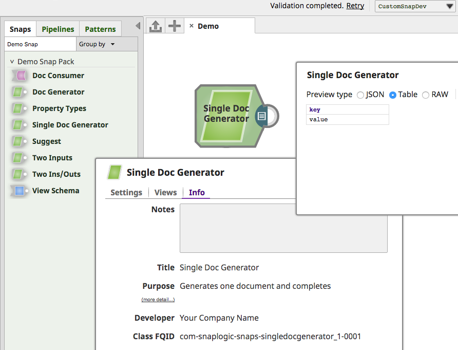
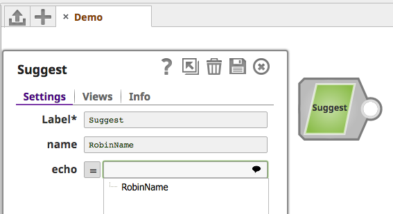
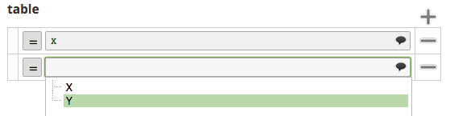
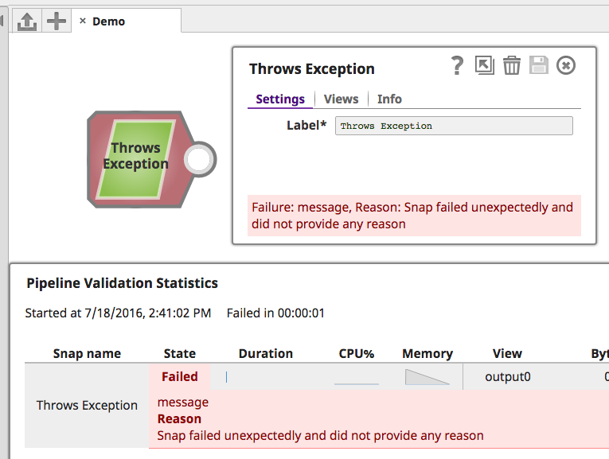

# Introduction

This documentation guides a developer through the steps necessary to develop **Snaps** for the [SnapLogic Intelligent Integration Platform](https://www.snaplogic.com/).

## Snaps and Snap Packs

SnapLogic [Snaps](https://docs-snaplogic.atlassian.net/wiki/spaces/SD/pages/1439259/Snap+Reference) are modular collections of integration components built for a specific application or data source. Snaps shield both business users and developers from much of the complexity of the underlying application, data model, and service.


Snap Packs logically organize Snaps and are the deployable unit when adding/modifying Snaps to the SnapLogic Intelligent Integration Platform. For instance, in the above example, the Aggregate Snap is part of the Transform Snap Pack. 

Snaps may be related by functionality or share common code. A Snap Pack may contain a single Snap or multiple Snaps.</img>

## Snap Fundamentals

Snaps are streaming data processors. They can consume and/or produce Binary or Document data through input and output views, and can report error Documents to an optional error view. 


They have metadata that define their view settings and configuration. They can read/poll from an endpoint, batch execute or process each input individually, and may write to another endpoint.

Snaps can provide design-time Suggest/lookup and Preview/validate data capabilities, or run in full execution mode.


## Snaps vs Scripts

SnapLogic's [Script Snap](http://doc.snaplogic.com/com-snaplogic-snaps-script-script_2) executes a JavaScript, Jython, or JRuby script using the JVM `ScriptEngine` mechanism. 

Consider the following when deciding whether to develop a custom Snap vs using the Script Snap:

Custom Snap | Script Snap
--------- | -----------
Supports easy configuration without coding | Working directly with code
Supports pipeline `_parameters` | Does not support pipeline `_parameters`
Supports Binary or Document input/output | Supports only Document input/output
Supports Accounts, simplify impersonation |	Does not support Accounts
Supports debugging during development | Often awkward to debug
Supports unit testing during/after development | Cannot be unit tested
Java | JavaScript, Jython, or JRuby
Need to build/deploy/etc | No deployment, quick & simple

# Prerequisites

* Java 11 (JDK)
* Maven 3.8.1 or later
* A Snaplex

<aside class="notice">
We also recommend using an Java IDE like <a href="https://www.jetbrains.com/idea">IntelliJ IDEA</a> or <a href="https://eclipse.org/ide/">Eclipse</a>.
</aside>

# Setting up the Snaplex

A [Snaplex](https://docs-snaplogic.atlassian.net/wiki/spaces/SD/pages/1437953/Snaplex) is the data processing engine of the [SnapLogic Intelligent Integration Platform](https://www.snaplogic.com/products/how-it-works). A locally-installed/on-premises Snaplex (also known as a "Groundplex" or "JCC") will be used throughout this guide to develop, execute and debug a Snap.

## Downloads

A Snaplex may be installed on:

* Linux
* Microsoft Windows
* macOS (for development only)

<aside class="notice">
The current list of Snaplex downloads is maintained at <a href="https://docs-snaplogic.atlassian.net/wiki/spaces/SD/pages/1438332/Snaplex+Downloads">https://docs-snaplogic.atlassian.net/wiki/spaces/SD/pages/1438332/Snaplex+Downloads</a>.
</aside>

## Installation

A Snaplex is the data processing engine of the SnapLogic Intelligent Integration Platform. An Org admin can select **Provision this user as a Snap Developer** in the **Update User** dialog, automatically creating a dedicated Snaplex for that user to run and test pipelines. This Snaplex should be created in the Snap Developer’s project folder so that other users do not inadvertently run production pipelines on that Snaplex.

### Linux & Microsoft Windows

Please visit the official SnapLogic documentation for detailed instructions for installing a Snaplex on [Linux](https://docs-snaplogic.atlassian.net/wiki/spaces/SD/pages/1438367/Snaplex+Installation+on+Linux) or [Microsoft Windows](https://docs-snaplogic.atlassian.net/wiki/spaces/SD/pages/1439002/Snaplex+Installation+on+Windows). 

### macOS 

<aside class="warning">
Use of a Snaplex in a macOS environment is supported only for developing Snaps.
</aside>

```shell
$ cd ~
$ brew install wget
$ wget https://s3.amazonaws.com/elastic.snaplogic.com/snaplogic-sidekick...rpm
$ /usr/bin/ruby -e "$(curl -fsSL https://raw.githubusercontent.com/Homebrew/install/master/install)"
$ brew install rpm2cpio
$ rpm2cpio.pl snaplogic-sidekick...rpm | cpio -idvm
$ mkdir -p ~/opt/snaplogic/etc
$ unzip myplex.slpropz -d ~/opt/snaplogic/etc
$ echo 'export SL_ROOT=~/opt/snaplogic' >> ~/.bash_profile
$ source ~/.bash_profile
```

> If successful, the output of the `cpio` command will list the Snaplex files populating the newly created `~/opt/snaplogic` directory, for example:

```shell
$ rpm2cpio.pl snaplogic-sidekick-4.mrc244-x86_64.rpm | cpio -idvm
./opt/snaplogic/bin/functions
./opt/snaplogic/bin/jcc.sh
./opt/snaplogic/bin/logstash.sh
./opt/snaplogic/ldlib/libsapjco3.jnilib
./opt/snaplogic/ldlib/libsapjco3.so
./opt/snaplogic/pkgs/jre1.8.0_45/COPYRIGHT
...
./opt/snaplogic/run/lib/jcc.war
./opt/snaplogic/run/lib/logstash.jar
./opt/snaplogic/run/log
1044673 blocks
```

1. `cd` to your home directory
1. Instructions for downloading the `.rpm` file can be found [here](https://docs-snaplogic.atlassian.net/wiki/spaces/SD/pages/1438332/Snaplex+Downloads)
1. Download and install [Homebrew](https://brew.sh/)
1. Install the `rpm2cpio` library
1. Extract the downloaded Snaplex `.rpm` file
1. Unzip the downloaded `.slpropz` file to the `etc` directory of your Snaplex
1. Export the `SL_ROOT` environment variable to your `~/.bash_profile`


## Running

```shell
$ cd ~/opt/snaplogic/run/lib
$ java -jar jcc.war jcc
```

> If successful, the output of the `java` command will be similar to this:

```shell
...
	+- file:/Users/snapdev/opt/snaplogic/run/lib/jcc/zookeeper-3.4.6.jar
	+- sun.misc.Launcher$AppClassLoader@42a57993
		+- file:/Users/snapdev/opt/snaplogic/run/lib/jcc.war
		+- sun.misc.Launcher$ExtClassLoader@14ae5a5
2016-07-01T00:59:04,505 I main	[  ] Server listening for incoming connections
```
The simplest way to start the Snaplex is to run the packaged `jcc.war` file.

To check if the Snaplex started correctly, log in to the [SnapLogic Dashboard](https://elastic.snaplogic.com/sl/dashboard.html):


<aside class="success">
A green check mark beside the Snaplex entry will indicate a healthy instance.
</aside>

# Snap Anatomy 101

```java
import com.snaplogic.api.ConfigurationException;
import com.snaplogic.api.ExecutionException;
import com.snaplogic.api.Snap;
import com.snaplogic.common.properties.builders.PropertyBuilder;
import com.snaplogic.snap.api.PropertyValues;
import com.snaplogic.snap.api.SnapCategory;
import com.snaplogic.snap.api.capabilities.Category;
import com.snaplogic.snap.api.capabilities.General;
import com.snaplogic.snap.api.capabilities.Version;
import com.snaplogic.snap.api.capabilities.Inputs;
import com.snaplogic.snap.api.capabilities.Outputs;
import com.snaplogic.snap.api.capabilities.Errors;
import com.snaplogic.snap.api.capabilities.ViewType;

@General(title = "Snap Name", purpose = "Description", 
		author = "Company Name", docLink = "http://www.docs.com/mysnap")
@Inputs(min = 0, max = 1, accepts = {ViewType.DOCUMENT})
@Outputs(min = 1, max = 1, offers = {ViewType.DOCUMENT})
@Errors(min = 1, max = 1, offers = {ViewType.DOCUMENT})
@Version(snap = 1)
@Category(snap = SnapCategory.READ)
public class MySnap implements Snap {

    @Override
    public void defineProperties(PropertyBuilder propertyBuilder) {
    }

    @Override
    public void configure(PropertyValues propertyValues) throws ConfigurationException {
    }

    @Override
    public void execute() throws ExecutionException {
    }

    @Override
    public void cleanup() throws ExecutionException {
    }
}
```

At its most basic, a Snap class declares the required name, view, version and category metadata annotations and implements the `Snap` interface.

### Metadata annotations

* `@General`: name, description, author, and documentation link for the Snap.
* `@Inputs`: specifies the minimum and maximum number of Input Views and the type of input they accept (JSON Documents or Binary data).
* `@Outputs`: specifies the minimum and maximum number of Output Views and the type of output they produce (JSON Documents or Binary data).
* `@Errors`: specifies whether an Error Views should be written to
* `@Version`: version number for the Snap (not to be confused with the Snap Pack version).
* `@Category`: [categorizes the Snap](#snap-categories) and determines the icon/color of the Snap within the SnapLogic Designer.

### Snap interface

The `com.snaplogic.api.Snap` interface that should be implemented by the Snap developers to convert their business logic into an entity that can be used inside SnapLogic Pipelines.
 
**`defineProperties`**

Defines the Snap properties using the given `PropertyBuilder`. This method is called during [the `compile` phase](https://maven.apache.org/guides/introduction/introduction-to-the-lifecycle.html#Build_Lifecycle_Basics) and generates the `settings` Snap schema property that the SnapLogic Designer uses to build the user interface.

**`configure`**

Configures the Snap with the `PropertyValues` provided by the user's input to the Snap Settings. Input validation should be done here - if there is an issue with the provided input, a `ConfigurationException` should be thrown.

**`execute`**

Executes the Snap's business logic. Should an error be encountered, an `ExecutionException` may be thrown.

**`cleanup`**

Cleans up any suitable resources after the Snap execution. Again, should an error be encountered, an `ExecutionException` may be thrown.

<aside class="notice">
Both <code>ConfigurationException</code> and <code>ExecutionException</code> are implementations of the root <code>SnapException</code> interface.

See the <a href="#exceptions-and-error-views">Exceptions and Error Views</a> section for more information.
</aside>

# Getting Started

```shell
$ mkdir ~/opt/snaplogic-dev
$ echo 'export SNAP_HOME=~/opt/snaplogic-dev' >> ~/.bash_profile
$ echo 'export JCC_DEBUG_PORT=9000' >> ~/.bash_profile
$ source ~/.bash_profile
```

If a healthy Snaplex is running locally, Snap Development may begin. 

Make a directory where Snap Development will occur, export the location as the `SNAP_HOME` environment variable and set the port to use for debugging.

## Debugging

```shell
$ cd ~/opt/snaplogic/run/lib
$ java -agentlib:jdwp=transport=dt_socket,server=y,address=${JCC_DEBUG_PORT},suspend=n -jar jcc.war jcc
```

> This will wait to launch the JCC until you have attached the debugger.

The Snaplex/JCC supports debugging a Snap's execution with your chosen IDE. Simply launch the JCC with the additional `agentlib` parameter with shown value, and attach to it using your IDE's remote debugging capability.

## Snap Maven Archetype

```
$ cd $SNAP_HOME
$ mvn org.apache.maven.plugins:maven-archetype-plugin:2.4:generate -DarchetypeCatalog=https://snaplogiceng.jfrog.io/artifactory/thirdparty/
[INFO] Scanning for projects...
[INFO] 
[INFO] ------------------< org.apache.maven:standalone-pom >-------------------
[INFO] Building Maven Stub Project (No POM) 1
[INFO] --------------------------------[ pom ]---------------------------------
[INFO] 
[INFO] >>> maven-archetype-plugin:2.4:generate (default-cli) > generate-sources @ standalone-pom >>>
[INFO] 
[INFO] <<< maven-archetype-plugin:2.4:generate (default-cli) < generate-sources @ standalone-pom <<<
[INFO] 
[INFO] 
[INFO] --- maven-archetype-plugin:2.4:generate (default-cli) @ standalone-pom ---
[INFO] Generating project in Interactive mode
[INFO] No archetype defined. Using maven-archetype-quickstart (org.apache.maven.archetypes:maven-archetype-quickstart:1.0)
Choose archetype:
1: https://snaplogiceng.jfrog.io/artifactory/thirdparty/ -> com.snaplogic.tools:SnapArchetype (An archetype that creates a Snap Pack, with example Snaps provided)
Choose a number or apply filter (format: [groupId:]artifactId, case sensitive contains): : 1
Choose com.snaplogic.tools:SnapArchetype version: 
1: 4.25
2: 4.26
3: 4.27
4: 4.28
5: 4.29
Choose a number: 5: 
Define value for property 'groupId': : com.snaplogic
Define value for property 'artifactId': : demosnappack
Define value for property 'version':  1.0-SNAPSHOT: : 
Define value for property 'package':  com.snaplogic: : com.snaplogic.snaps
Define value for property 'organization': : Partners
Define value for property 'assetPath':  /Partners/shared: : /Partners/MyCompany/shared
Define value for property 'snapPack':  demosnappack: : Demo Snap Pack
Define value for property 'user': : cc+partners@snaplogic.com    (should match cc.username in $SL_ROOT/etc/keys.properties)
Confirm properties configuration:
groupId: com.snaplogic
artifactId: demosnappack
version: 1.0-SNAPSHOT
package: com.snaplogic.snaps
organization: Partners
assetPath: /Partners/MyCompany/shared
snapPack: Demo Snap Pack
user: cc+partners@snaplogic.com
 Y: : y
[INFO] ----------------------------------------------------------------------------
[INFO] Using following parameters for creating project from Archetype: SnapArchetype:4.29
[INFO] ----------------------------------------------------------------------------
[INFO] Parameter: groupId, Value: com.snaplogic
...
```


A [Maven Archetype](https://maven.apache.org/guides/introduction/introduction-to-archetypes.html) is a Maven project templating toolkit. SnapLogic provides `SnapArchetype` for quickly starting Snap development.

<aside class="notice">
The Snap archetype catalog is available at <a href="https://snaplogiceng.jfrog.io/artifactory/thirdparty/">https://snaplogiceng.jfrog.io/artifactory/thirdparty/</a>
<p><p>
Version 3.0.0 of Maven Archetype Plugin removed the ability to reference a remote, non-central archetype catalog - hence the use of the 2.4 version of the plugin above. See <a href="https://issues.apache.org/jira/browse/ARCHETYPE-519">ARCHETYPE-519</a> for more details.
</aside>

`SnapArchetype` ships with eight sample Snaps for demonstration purposes:

Sample | Description
--------- | -----------
**Single Doc Generator** | *Outputs a single document*
**Doc Consumer** | *Consumes documents*
**Doc Generator** | *Outputs `n` documents, where `n` is specified by the user as an expression*
**Suggest** | *Demonstrates suggest setting capabilities*
**Property Types** | *Shows creating a variety of different Snap UI settings*
**Two Inputs** | *Consuming from two different input sources*
**Two Inputs Two Outputs** | *Consuming from two different input sources, and outputting two different Documents*
**Schema Example** | *Demonstrating input and output schemas for IO validation*
**Character Counter** | *Binary input and output views*
**Currency Converter** | *Demonstrates dependency injection*
**SnapWithAccount** | *Authenticating with an `ExampleAccount`*

<aside class="warning">
If you choose a <code>groupId</code>/<code>package</code> value other than <code>com.snaplogic.snaps</code>, you must provide a HTTP URL value to the <code>docLink</code> parameter of a Snap's <code>@General</code> annotation on a Snap.
</aside>

Once `SnapArchetype` has been generated, it can be imported as a Maven project into your IDE ([IntelliJ IDEA](https://www.jetbrains.com/help/idea/2016.1/importing-project-from-maven-model.html), [Eclipse](https://books.sonatype.com/m2eclipse-book/reference/creating-sect-importing-projects.html), [Netbeans](http://wiki.netbeans.org/MavenBestPractices)).

## Project Structure
```
demosnappack
├── .mvn
│   └── maven.config
├── pom.xml
├── settings.xml
└── src
    ├── main
    │   ├── assembly
    │   │   ├── final.xml
    │   │   └── snap.xml
    │   ├── config
    │   │   └── directives
    │   ├── java
    │   │   └── com
    │   │       └── snaplogic
    │   │           └── snaps
    │   │               ├── CharacterCounter.java
    │   │               ├── CurrencyConverter.java
    │   │               ├── DocConsumer.java
    │   │               ├── DocGenerator.java
    │   │               ├── ExampleAccount.java
    │   │               ├── PropertyTypes.java
    │   │               ├── SchemaExample.java
    │   │               ├── SingleDocGenerator.java
    │   │               ├── SnapWithAccount.java
    │   │               ├── Suggest.java
    │   │               ├── TwoInputs.java
    │   │               └── TwoInputsTwoOutputs.java
    │   └── resources
    └── test
        ├── java
        │   └── com
        │       └── snaplogic
        │           └── snaps
        │               ├── CharacterCounterTest.java
        │               ├── CurrencyConverterTest.java
        │               ├── DocConsumerTest.java
        │               ├── DocGeneratorTest.java
        │               ├── PropertyTypesTest.java
        │               ├── SchemaExampleTest.java
        │               ├── SingleDocGeneratorTest.java
        │               ├── SnapWithAccountTest.java
        │               ├── SuggestTest.java
        │               └── TwoInputsTwoOutputsTest.java
        └── resources
            └── data
                ├── character_counter
                │   ├── binary_input.txt
                │   ├── character_counter_input_pointer.json
                │   └── expected
                │       └── characterCounter_WithSnapLogicAsInput_CountsOccurrences
                │           ├── outbin-output0-data-0.data
                │           └── outbin-output0-headers.json
                ├── currency_converter
                │   ├── exchange_rates_file.json
                │   ├── exchange_rates_from_file_properties.json
                │   ├── expected
                │   │   ├── currencyConversion_WithCustomInjector_ConvertsCorrectly-out.json
                │   │   ├── currencyConversion_WithExchangeRatesDataSupplier_ConvertsCorrectly-out.json
                │   │   ├── currencyConversion_WithExchangeRatesFromDataFiles_ConvertsCorrectly-out.json
                │   │   └── currencyConverstion_WithFieldMockedDirectly_ConvertsCorrectly-out.json
                │   └── input_documents.json
                ├── doc_generator
                │   ├── doc_generator_properties.json
                │   └── expected
                │       ├── docGenerator_WithExpectedErrorPath_OutputsErrorDocumentCorrectly-err.json
                │       ├── docGenerator_WithExpectedOutputPath_OutputsDocumentsCorrectly-out.json
                │       ├── docGenerator_WithProperties_OutputsCorrectNumberOfDocuments-out.json
                │       └── docGenerator_WithPropertyOverrides_OutputsCorrectNumDocuments-out.json
                ├── property_types
                │   ├── expected
                │   │   └── propertyTypes_WithFieldsCompositesAndTables_OutputsEvaluatedValuesDocument-out.json
                │   └── property_types_properties.json
                ├── schema_example
                │   ├── expected
                │   │   ├── schemaExample_WithInvalidData_OutputsErrorDocumentOnly-err.json
                │   │   └── schemaExample_WithValidData_OutputsDocument-out.json
                │   ├── schema_invalid_input.data
                │   └── schema_valid_input.data
                ├── single_doc_generator
                │   └── expected
                │       └── singleDocGenerator_WithOutputView_OutputsCorrectNumDocuments-out.json
                ├── snap_with_account
                │   ├── account_properties.json
                │   └── expected
                │       └── snapWithAccount_WithAccountProperties_OutputsCorrectToken-out.json
                ├── suggest
                │   ├── expected
                │   │   └── suggest_WithSuggestProperty_WritesResultsToSpecialOutputView-out.json
                │   └── suggest_properties.json
                └── two_inputs_two_outputs
                    ├── expected
                    │   └── twoInputsTwoOutputs_WithParentsAndChildren_GroupsByGender-out.json
                    └── input_files.json
```
A Snap Project's structure follows [Maven's Standard Directory Layout](https://maven.apache.org/guides/introduction/introduction-to-the-standard-directory-layout.html).

### `src/main/assembly`

`final.xml` and `snap.xml` are used by the `maven-assembly-plugin` to build the Snap Pack zip file that can be uploaded to the SnapLogic Manager. You should not need to alter these files.

### `src/main/config`

`directives` contains basic Snap Pack metadata. 

The `NAME` property is the label of Snap Pack. This is visible when the SnapLogic Designer is grouping by Snap Pack e.g. the Snaps related to SQL Server are grouped under "SQL Server".


The `ASSET_DIR_PATH` property instructs the Snap Pack Installer to deploy the Snap Pack to the specified asset path.

A customer will be deploying to an Organization root, Project, or Project Spaces asset path e.g. `/snaplogic/shared`, `/snaplogic/projects/rhowlett`, and `/snaplogic/robin/shared` respectively (where "snaplogic" is the Organization name assigned by SnapLogic to your account, "rhowlett" is the Project folder name, and "robin" is the Project Spaces. 

This value can be changed dynamically at build time using the `-Dasset_path` Maven parameter (especially useful with a continuous integration tool, or if your company has multiple Organizations or wishes to deploy to multiple asset path locations).

### `src/main/java` and `src/main/resources`

Files and folders within these directories will be on the classpath, as per Maven convention. This is where you will write your Snap code.

### `src/test/java` and `src/test/resources`

Files and folders within these directories will be on the test classpath, as per Maven convention. Unit and integration tests (and supporting resources) are located in these directories.

### `pom.xml`

This is the Maven POM file. You will change this file when registering new Snaps and Accounts, when new dependencies or plugins are required, or when needing to modify the build properties.

The `dependencyManagement` section imports the SnapLogic BOM file, `com.snaplogic.snaps:bom`, to simplify dependency management:

```xml
<dependencyManagement>
    <dependencies>
        <!-- import dependency management declarations from the SnapLogic snaps BOM -->
        <dependency>
            <groupId>com.snaplogic.snaps</groupId>
            <artifactId>bom</artifactId>
            <version>${snaplogic.snaps.version}</version>
            <type>pom</type>
            <scope>import</scope>
        </dependency>
    </dependencies>
</dependencyManagement>
```

The `dependencies` section of the POM file can reference dependencies managed by the BOM file without specifying their version:

```xml
<!-- SnapLogic jsdk + japis dependencies, declared in bom -->
<dependency>
    <groupId>com.snaplogic</groupId>
    <artifactId>jsdk</artifactId>
</dependency>
<dependency>
    <groupId>com.snaplogic</groupId>
    <artifactId>jutils</artifactId>
</dependency>
<dependency>
    <groupId>com.snaplogic</groupId>
    <artifactId>jtest</artifactId>
    <scope>test</scope>
</dependency>

<!-- third-party dependencies bundled in jcc and declared in bom with provided scope -->
<dependency>
    <groupId>com.fasterxml.jackson.core</groupId>
    <artifactId>jackson-databind</artifactId>
</dependency>
...
```

The POM also includes other `dependencies` needed by the sample Snaps:

```xml
<dependency>
    <groupId>commons-codec</groupId>
    <artifactId>commons-codec</artifactId>
</dependency>
<dependency>
    <groupId>commons-io</groupId>
    <artifactId>commons-io</artifactId>
</dependency>
<dependency>
    <groupId>com.google.guava</groupId>
    <artifactId>guava</artifactId>
</dependency>
<dependency>
    <groupId>junit</groupId>
    <artifactId>junit</artifactId>
    <scope>test</scope>
</dependency>
...
```

# Developing Snaps

The `properties` section of the POM file has two properties, `snap.classes` and `account.classes`, which list the names
of the Java classes which define the Snaps and Accounts provided by this Snap pack:

```xml
<!-- This identifies the classes which represent the actual Snaps
	(and become accessible on the Snaplex/JCC after deployment).
	
	After creating a new Snap class, add it here.
-->
<snap.classes>
	com.snaplogic.snaps.CharacterCounter,
	com.snaplogic.snaps.CurrencyConverter,
	com.snaplogic.snaps.DocConsumer,
	com.snaplogic.snaps.DocGenerator,
	com.snaplogic.snaps.PropertyTypes,
	com.snaplogic.snaps.SchemaExample,
	com.snaplogic.snaps.SingleDocGenerator,
	com.snaplogic.snaps.SnapWithAccount,
	com.snaplogic.snaps.Suggest,
	com.snaplogic.snaps.TwoInputs,
	com.snaplogic.snaps.TwoInputsTwoOutputs
</snap.classes>
<!-- This identifies the classes which represent the actual Accounts
	(and become accessible on the Snaplex/JCC after deployment).
	
	After creating a new Account class, add it here.
-->
<account.classes>
	com.snaplogic.snaps.ExampleAccount
</account.classes>
```

> pom.xml

SnapLogic provides the **JSDK**, a library of Java APIs to assist with building Snaps. 

The [Snap Maven Archetype](#snap-maven-archetype) ships with sample Snaps that we can use to highlight the JSDK's capabilities.

## Basic Snap Implementation

```java
// Set the Snap title, description etc
// Also, use the "docLink" parameter to set a link to the documentation
@General(title = "Single Doc Generator", purpose = "Generates one document and completes",
        author = "Your Company Name", docLink = "http://yourdocslinkhere.com")
// This Snap does not permit input views for demonstration purposes, however, in practice, there
// should almost always be an input view
@Inputs(min = 0, max = 1, accepts = {ViewType.DOCUMENT})
// This snap has exactly one document output view (min = 1, max = 1).
// Snaps can also have binary output i.e., offers={ViewType.BINARY}
@Outputs(min = 1, max = 1, offers = {ViewType.DOCUMENT})
// This snap has an optional document error view(min = 1, max = 1).
// Snaps can also have binary error view i.e., offers={ViewType.BINARY}
@Errors(min = 1, max = 1, offers = {ViewType.DOCUMENT})
// Version number of the snap
@Version(snap = 1)
// This snap belongs to SnapCategory.READ as it is idempotent.
@Category(snap = SnapCategory.READ)
public class SingleDocGenerator implements Snap {
    private static final Logger log = LoggerFactory.getLogger(SingleDocGenerator.class);
    
    int counter = 0;
    
    @Inject
    private DocumentUtility documentUtility;
    @Inject
    private OutputViews outputViews;

    @Override
    public void defineProperties(PropertyBuilder propertyBuilder) {
    }

    @Override
    public void configure(PropertyValues propertyValues)
            throws ConfigurationException {
    }

    @Override
    public void execute() throws ExecutionException {
        counter++;
        log.debug("counter=" + counter);

        /*
         * Write a single document to outputView. The next snap in the pipe will
         * only ever see a single document from this snap.
         */
        Map<String, String> data = new LinkedHashMap<String, String>() {{
            put("key", "value");
        }};
        outputViews.write(documentUtility.newDocument(data));
    }

    @Override
    public void cleanup() throws ExecutionException {
    }
}
```

`SingleDocGenerator` is one of the sample Snaps included in the Snap Archetype. 

It is an uncomplicated Snap that generates a single document, without requiring any input data or user input. It implements the `Snap` interface.



[Snap Anatomy 101](#snap-anatomy-101) explains the purpose of each annotation and the overridden methods. The comments above each annotation describe their specific usage for this Snap.

<aside class="notice">
For simplicity, the <strong>"Single Doc Generator"</strong> Snap does not permit any input views. However, for general Snap development, there should <strong>almost always</strong> be an input view. See <a href="#reading-documents-from-an-input-view">Reading Documents from an Input View</a> for more.
</aside>

### Snap Lifecycle

At build time, `defineProperties` is called to generate the Snap Schema. This will construct the Snap's settings tab.

At runtime, the Snap is initialized by the Snaplex/JCC. Next, [Guice](https://github.com/google/guice) injects the various declared dependency instances (`documentUtility` and `outputViews` in this Snap).

The Snaplex's runtime then instructs the Snap's `configure` method to be called to validate and/or operate on any provided `PropertyValues` created from a user's interaction with the Snap's settings.

Next, the `execute` method is called. This is where the majority of the Snap's business logic will initiate.

Finally, the `cleanup` method is called to clean-up any resources used.

Due to no user input being required, nor clean-up needed, the `defineProperties`, `configure`, and `cleanup` methods have no implementation for this Snap. 

The `execute` method increments an `int` member variable, logs a debug statement, creates data, and generates a new Document with this data to be subsequently written to the output view.

## Logging

```shell
$ brew install lnav
$ lnav -i https://snaplogic.box.com/v/lnav-log-format
$ lnav ~/opt/snaplogic/run/log/jcc.json

2016-07-13T13:10:35.072 DEBUG [Single Doc Generator[5d64230b-fa22-4696-b736-05b599b06ba9 -- 9a3a88ef-d5b1-4715-945d-0c6a595f7940]] (SingleDocGenerator.java:77) - counter=1                                                                                      │
  snrd: 9a3a88ef-d5b1-4715-945d-0c6a595f7940                                                                                                                                                                                                                     │
  com.snaplogic.logging.id: 57868ceb64cabf28873d20a7.5d64230b-fa22-4696-b736-05b599b06ba9.9a3a88ef-d5b1-4715-945d-0c6a595f7940                                                                                                                                   │
  plrd: 5d64230b-fa22-4696-b736-05b599b06ba9                                                                                                                                                                                                                     │
  snlb: Single+Doc+Generator                                                                                                                                                                                                                                     │
  ccid: 57868ceb64cabf28873d20a7                                                                                                                                                                                                                                 │
  snii: 898c5459-0419-455c-9493-a0d6fbae9c8a                                                                                                                                                                                                                     │
  xid: a83bcfdd-2bc7-480e-bf1e-5fbdfef3c726   
```

In [the "Single Doc Generator" sample Snap](#basic-snap-implementation) above, an SLF4J `Logger` static class variable is declared and initialized and is used to write debug messages to the Snaplex/JCC's log.

For example, when previewing or executing the "Single Doc Generator" Snap in the Designer, the value of the `counter` variable is written to the log. 

This entry can then be viewed in the Snaplex's `jcc.json` log file (we recommend using [LNAV, the log file navigator](https://www.snaplogic.com/blog/lnav/) created by SnapLogic's own Timothy Stack):

## Creating Documents with DocumentUtility

```java
package com.snaplogic.snap.api;

public interface DocumentUtility {
	...
	/**
	 * Returns a new document with the given data for the given incoming document.
	 *
	 * @param incomingDocument
	 * @param data
	 * @return document
	 */
	Document newDocumentFor(Document incomingDocument, Object data);

	/**
	 * Returns a new document object with the given data and merges the original data into the
	 * new returned document.
	 * This allows to "pass through" the data from an incoming document and merge it into the new
	 * document being written to the output. The new document will have an {@literal original}
	 * key holding the original document to avoid data being overwritten when merging the data
	 * with original data
	 *
	 * @param document     as the document being written
	 * @param originalData as original data being merged with the document.
	 *
	 * @return document
	 * @throws UnsupportedOperationException only data and originalData of type Map is currently
	 *                                       supported
	 */
	Document newDocument(Document document, Object originalData);
	...
}
```

Guice's `@Inject` annotation will instruct the Snaplex/JCC to inject an instance of `DocumentUtility` and assign it to `documentUtility` ([see "Single Doc Generator" Snap above](#basic-snap-implementation)).

Documents may be created with given data. 

<aside class="success">
Data should be created either as a single <code>LinkedHashMap</code> instance (to preserve field ordering) or a <code>List</code> of <code>LinkedHashMap</code> instances. Avoid data being just a primitive data type or <code>null</code>.
</aside>

### Lineage

For Snaps that have input views and process documents, you should preserve [data lineage](https://en.wikipedia.org/wiki/Data_lineage) (required by [Ultra Pipelines](https://www.snaplogic.com/blog/ultra_pipeline_design)) between the new output document to be written and the incoming original document by using one of the highlighted `DocumentUtility` methods:

*Establishes lineage between the new document and the incoming original document, but discards the incoming data:*<br />
`Document newDocumentWithLineage = documentUtility.newDocumentFor(originalDocument, data);`

*Establishes lineage between the new document and the incoming original document and "passes through" the incoming document's data by adding a key named "original" (containing the incoming original document's data) to the new document:*<br />
`Document seed = documentUtility.newDocument(newData);`<br />
`Document newDocumentWithLineage = documentUtility.newDocument(seed, originalDocument);`

<aside class="success">
We recommend that you do pass through the original document for greatest flexibility.
</aside>

## Writing Documents to an Output View

```java
package com.snaplogic.snap.api;

/**
 * OutBoundViews is the base interface for all the output views - {@link OutputView} and
 * {@link com.snaplogic.snap.view.ErrorView}
 */
public interface OutBoundViews<V extends OutputView> extends Views<V> {
	...
	/**
	 * Writes the given document to all the outbound views of the Snap.
	 *
	 * @param document
	 */
	void write(Document document);

	/**
	 * Writes a new document object with the given data and merges the original data into the
	 * new returned document.
	 * This allows to "pass through" the data from an incoming document and merge it into the new
	 * document being written to the output. The new document will have an {@literal original}
	 * key holding the original document to avoid data being overwritten when merging the data
	 * with original data.
	 *
	 * @param document     as the document being written
	 * @param originalData as original data being merged with the document.
	 *
	 * @return document
	 * @throws UnsupportedOperationException only data and originalData of type Map is currently
	 *                                       supported
	 */
	void write(Document document, Object originalData);
	...
}
```

Guice's `@Inject` annotation will instruct the Snaplex/JCC to inject an instance of `OutputViews` and assign it to `outputViews` ([see "Single Doc Generator" Snap above](#basic-snap-implementation)).

### Lineage

Similarly to [DocumentUtility](#creating-documents-with-documentutility), output views can establish lineage between incoming and outgoing documents. This is useful when an outgoing Document has been created without lineage but the incoming original document is still accessible:

`outputViews.write(documentWithoutLineage, originalDocument);`

## Unit Testing Snaps with SnapTestRunner

```java
import com.snaplogic.snap.test.harness.OutputRecorder;
import com.snaplogic.snap.test.harness.SnapTestRunner;
import com.snaplogic.snap.test.harness.TestFixture;
import com.snaplogic.snap.test.harness.TestResult;

import org.junit.runner.RunWith;

import static org.junit.Assert.assertEquals;
import static org.junit.Assert.assertNull;

/**
 * Tests that the {@link SingleDocGenerator} Snap sent one Document to the output view.
 */
@RunWith(SnapTestRunner.class)
public class SingleDocGeneratorTest {

    // "snap" attribute targets the Snap being executed
    // "outputs" defines the name of the output view to write to
    @TestFixture(snap = SingleDocGenerator.class,
            outputs = "output0")
    public void singleDocGenerator_WithOutputView_OutputsCorrectNumDocuments(TestResult testResult)
            throws Exception {
        OutputRecorder outputRecorder = testResult.getOutputViewByName("output0");
        assertEquals(1, outputRecorder.getRecordedData().size());
    }
}
```

The `SingleDocGeneratorTest` class outlines basic usage of **jtest**, a JUnit-based Snap unit testing framework.

jtest provides `SnapTestRunner`, a custom JUnit test runner which simulates the targeted Snap being executed within a pipeline. 

Test methods are annotated with the `@TestFixture` annotation, which specifies what Snap implementation to use, input/output/error views configured, property settings specified, accounts associated etc.

The test method should take a single `TestResult` argument, which can be used within the test to determine whether the correct output was written (using an `OutputRecorder`), if errors occurred etc.

In the `SingleDocGeneratorTest` sample provided, we can see that the test method focuses on examining that the `TestResult` did not receive any thrown exceptions, and that the declared output view registered the expected number of documents processed.

The ["jtest: Snap Unit Testing Framework"](#jtest-snap-unit-testing-framework) section contains much more information about testing Snaps, including working towards a purely declarative style of Snap unit testing using just the test method's `@TestFixture` annotation.

## Reading Documents from an Input View

```java
@General(title = "Doc Consumer", purpose = "Consumes the incoming documents",
        author = "Your Company Name", docLink = "http://yourdocslinkhere.com")
@Inputs(min = 1, max = 1, accepts = {ViewType.DOCUMENT})
@Outputs(min = 0, max = 0, offers = {ViewType.DOCUMENT})
@Errors(min = 1, max = 1, offers = {ViewType.DOCUMENT})
@Version(snap = 1)
@Category(snap = SnapCategory.WRITE)
public class DocConsumer implements Snap {
    private static final Logger log = LoggerFactory.getLogger(DocConsumer.class);
    private final AtomicInteger count = new AtomicInteger(0);

    @Inject
    private InputViews inputViews;

    @Override
    public void defineProperties(PropertyBuilder propertyBuilder) {
    }

    @Override
    public void configure(PropertyValues propertyValues) throws ConfigurationException {
    }

    @Override
    public void execute() throws ExecutionException {
        InputView inputView = inputViews.get();
        Iterator<Document> documentIterator = inputViews.getDocumentsFrom(inputView);
        while (documentIterator.hasNext()) {
            Document doc = documentIterator.next();
            log.debug("Received Document {}", doc.toString());
            count.getAndIncrement();
        }
    }

    @Override
    public void cleanup() throws ExecutionException {
        log.debug("Consumed {} documents", count.get());
    }
}
```

The `DocConsumer` sample Snap that ships with the [Snap Archetype](#snap-maven-archetype) demonstrates how to read from a Snap's input view.

Similarly to [Writing Documents to an Output View](#writing-documents-to-an-output-view), Guice will inject an instance of `InputViews` and assign it to the `inputViews` variable.

`inputViews.get()` returns the default view associated with the Snap. If the Snap has more than one view, a `ViewException` is thrown.

An `Iterator` of `Document` objects can then be acquired by asking the `InputViews` instance for the `Document` objects associated with the specified `InputView` instance.

Iterating over the `Document` objects, the Snap logs that a document was consumed and increments its `AtomicInteger` counter.

The `cleanup()` method, which is called after the Snap has completed its execution phase, logs the total number of documents consumed.


<aside class="notice">
SnapLogic's Platform will enforce that all input documents have been fully consumed, otherwise an error will occur and the pipeline will fail.
<br />
<br />If some documents are consumed but "dropped on the floor" (not written to either an output or error view, or used to create another <code>Document</code>), call <code>document.acknowledge</code> to indicate it has been consumed.
</aside>

## Snap Categories

The [Doc Consumer Snap's](#reading-documents-from-an-input-view) category (`SnapCategory.WRITE`) differs from [SingleDocGenerator's](#basic-snap-implementation) `SnapCategory.READ` category. 

This difference between category types manifests in three ways:

* the color and icon of the Snaps are different,
* the "Doc Consumer" Snap inherits an "Execute during Preview" setting to toggle whether the Snap will execute when the Pipeline is validating/previewing,
* the Snaps are separated when "Group By Type" is chosen.


Icon | Snap Category | Description
----------- | ----------- | -----------
 | **READ** | Sources of data in the pipeline.<br />*Example: File Reader*
 | **WRITE** | Data destinations or sinks in the pipeline. They also inherit an "Execute during Preview" setting.<br />*Example: File Writer* 
 | **PARSE** |	Parse unstructured input data into structured output data.<br />*Example: CSV Parser*
 | **FORMAT** | Change data format.<br />*Example: CSV Formatter*
 | **TRANSFORM** | Modify data significantly.<br />*Example: Aggregate, Join*
 | **FLOW** | Change the direction or output of data in the pipeline.<br />*Example: Filter, Router*

As you develop Snaps, choose the appropriate Snap Category for your use cases.

## Bootstrapping with SimpleSnap

```java
/**
 * This snap accepts two inputs and outputs to a single output. To use it, feed
 * it two JSON documents. It will output a single stream which consists
 * of the combination of the two inputs, plus an additional "Processed" field in each.
 *
 * <p>This Snap extends {@link SimpleSnap} (instead of implementing {@link Snap}).</p>
 * <p>This means that instead of having a method called 'execute' which is called once,
 * it has a method called 'process' which is called for every document the snap receives.
 * This means you do not have to iterate over incoming documents as 'process' does that
 * for you.
 */
@General(title = "Two Inputs", purpose = "Accepts two inputs (expected phone books, merges them)",
        author = "Your Company Name", docLink = "http://yourdocslinkhere.com")
@Inputs(min = 2, max = 2, accepts = {ViewType.DOCUMENT})
@Outputs(min = 1, max = 1, offers = {ViewType.DOCUMENT})
@Errors(min = 0, max = 1, offers = {ViewType.DOCUMENT})
@Version(snap = 1)
@Category(snap = SnapCategory.READ)
public class TwoInputs extends SimpleSnap {

    private static final Logger log = LoggerFactory.getLogger(TwoInputs.class);
    private int count = 0;
    @Inject
    private OutputViews outputViews;

    @Override
    public void defineProperties(PropertyBuilder propertyBuilder) {
    }

    @Override
    public void configure(PropertyValues propertyValues)
            throws ConfigurationException {
    }

    @Override
    public void process(Document document, String inputViewName) {
        // Demonstrates how to create a new copy of the document
        Document newdoc = document.copy();

        // get a map representation of the document
        // NOTE: we are *not* duplicating the data.
        // We will *not* have to convert the map back to a doc.
        // It's just a pointer representation.
        @SuppressWarnings("unchecked")
        Map<String, Object> data = newdoc.get(Map.class);

        // assign a value to a field of the map
        // In this case, we are just assigning 'processed=True'
        // to signal that the document has been processed.
        data.put("processed", "True");

        count++;
        // log current document number
        log.debug("count=" + count);

        // log current document
        log.debug("document: " + newdoc.toString());

        // send new document to next snap
        outputViews.write(newdoc, document);
    }

    @Override
    public void cleanup() throws ExecutionException {
        // Log final number of documents processed
        log.debug("Final count=" + count);
    }
}
```

Now that we understand the basics of a Snap, we can extend the `SimpleSnap` class to have some of the heavy lifting done for us.

`SimpleSnap` provides all the necessary hooks for writing a new Snap. A Snap author can write a new Snap by simply extending `SimpleSnap`, adding the desired metadata annotations (`SimpleSnap` already declares an `@Errors` view that can be overridden), and providing the implementation for the `process` method (and optionally, for the `defineProperties` and `configure` methods too).

`SimpleSnap` takes care of iterating over the incoming documents (if any) and allowing you to process each document at a time. It also handles the dependency injection for the `Input/Output/ErrorViews`, the `DocumentUtility`, and the `ExecutionUtil` (which handles iterating over the documents in the incoming input view(s) on your behalf, and writing any thrown `SnapDataException` instances to the error view).


There are a number of other "Simple" Snap implementations that can help getting started quickly, including:

* `SimpleReadSnap`
* `SimpleWriteSnap`
* `SimpleBinarySnap`
* `SimpleBinaryReadSnap`
* `SimpleTransformSnap`
* `SimpleBinaryWriteSnap`

## Writing Binary Data to an Output View

```java
/**
 * A Snap that counts the number of occurrences of each letter in the English language for the
 * incoming data, and writes the result to a binary output view
 */
@General(title = "Character Counter", purpose = "Demo writing to Binary Output View",
        author = "Your Company Name", docLink = "http://yourdocslinkhere.com")
@Outputs(min = 1, max = 1, offers = ViewType.BINARY)
@Errors(min = 1, max = 1, offers = ViewType.DOCUMENT)
@Version(snap = 1)
public class CharacterCounter extends SimpleBinaryWriteSnap {

    ...

    @Override
    protected void process(final Document header, final ReadableByteChannel readChannel) {
        final StringBuilder sb = new StringBuilder();

        // Guava Multiset
        final Multiset<Character> bagOfChars = HashMultiset.create();

        try (InputStream inputStream = Channels.newInputStream(readChannel)) {
            Reader reader = new InputStreamReader(new BufferedInputStream(inputStream), UTF_8);

            // read in each character
            int characterRead;
            while ((characterRead = reader.read()) != -1) {
                // add the lowercase version of the character to the Multiset
                bagOfChars.add((char) Character.toLowerCase(characterRead));
            }
        } catch (IOException e) {
            errorViews.write(new SnapDataException(e, e.getMessage()), header);
        }

        try {
            // for each letter of English alphabet, write a line with the number of times
            // it appeared in the input data
            for (char letter = 'a'; letter <= 'z'; letter++) {
                sb.append(letter).append(":").append(bagOfChars.count(letter))
                        .append(System.lineSeparator());
            }
        } catch (Exception e) {
            // write to the error view when a problem processing the input data is encountered
            SnapDataException ex = new SnapDataException(e, "Unable to complete counting "
                    + "characters from input data.").withResolutionAsDefect();

            LinkedHashMap<String, String> data = new LinkedHashMap<>();
            data.put("content", sb.toString());

            errorViews.write(ex, documentUtility.newDocument(data));
            return;
        }

        outputViews.write(new BinaryOutput() {
            @Override
            public Document getHeader() {
                return header;
            }

            @Override
            public void write(WritableByteChannel writeChannel) throws IOException {
                try (OutputStream outputStream = Channels.newOutputStream(writeChannel)) {
                    IOUtils.write(sb.toString(), outputStream, UTF_8);
                }
            }
        });
    }

    ...
}
```

While JSON-based Documents offer the greatest flexibility of manipulating data within a pipeline, Binary data has advantages too. The costs associated with parsing and formatting data to JSON are avoided, and it can allow easier integration with processes running externally to the pipeline.

The `CharacterCounter` sample Snap shown demonstrates writing to a binary output view. It counts the number of times each letter of the English alphabet appears in the incoming binary data, and then writes the results to the binary output view (or, if there were any exceptions, creates an error Document and writes that to the error view).

In the sample, the `process()` method's implementation writes an anonymous `BinaryOutput` instance to the Snap's output view. 

The provided `ReadableByteChannel` argument is used to create an `InputStream`. The logic for counting each occurrence of each letter then follows before the results are written to an `OutputStream`, which is sent the `write()` method's `WritableByteChannel`, and then on to the Snap's binary output view:


## Reading Binary Data from an Input View

```java
package com.snaplogic.snap.api.write;
...
@Inputs(min = 1, max = 1, accepts = {ViewType.BINARY})
@Outputs(min = 0, max = 0)
@Category(snap = SnapCategory.WRITE)
public abstract class SimpleBinaryWriteSnap extends SimpleBinarySnap {

    @Inject
    private InputViews inputViews;

	// called by SimpleBinarySnap.execute()
    @Override
    protected void doWork() {
        for (InputView inputView : inputViews) {
            for (BinaryInput binaryData : inputViews.binaryInputs(inputView)) {
                ReadableByteChannel readChannel = null;
                try {
                    readChannel = binaryData.getChannel();
                    process(binaryData.getHeader(), readChannel);
                } catch (IOException e) {
                    throw new ExecutionException(e,
                            EXCEPTION_WHILE_READING_FROM_BINARY_INPUT);
                } finally {
                    IOUtils.closeQuietly(readChannel);
                }
            }
        }
    }

    /**
     * Processes the incoming binary data.
     */
    protected abstract void process(Document header, ReadableByteChannel readChannel);
}
```

The `CharacterCounter` class above extends the abstract `SimpleBinaryWriteSnap` class which, similarly to [Bootstrapping with SimpleSnap](#bootstrapping-with-simplesnap), provides some sensible default values for metadata annotations and some initial implementation.

The `doWork()` method iterates over the Snap's binary input views, returning a `BinaryInput` instance for each view. The `BinaryInput` contains a `ReadableByteChannel` (which can read the bytes of the incoming binary data) and a Document header containing basic metadata (`content-type` etc.).

As shown [in the **"Character Counter"** sample above](#writing-binary-data-to-an-output-view), these can then be used to create an `InputStream` or simliar to access and/or manipulate the binary data.

### Headers

Binary Headers are Documents used to store useful metadata about the binary data stream.

When creating `BinaryOutput` instances, a Document header should be created and returned in `getHeader()`.

<aside class="success">
We recommend using standard/popular specification field names, lowercased, when possible e.g. <code>"content-type"</code>, from the HTTP specification.
</aside> 

## Accepting User Input with PropertyBuilder

```java
@General(title = "Doc Generator", purpose = "Generates documents based on the configuration",
        author = "Your Company Name", docLink = "http://yourdocslinkhere.com")
@Inputs(min = 0, max = 1, accepts = {ViewType.DOCUMENT})
@Outputs(min = 1, max = 1, offers = {ViewType.DOCUMENT})
@Errors(min = 1, max = 1, offers = {ViewType.DOCUMENT})
@Version(snap = 1)
@Category(snap = SnapCategory.READ)
public class DocGenerator implements Snap {
    private static final String COUNT = "count";

    // Document utility is the only way to create a document
    // or manipulate the document header
    @Inject
    private DocumentUtility documentUtility;
    @Inject
    private OutputViews outputViews;
    @Inject
    private ErrorViews errorViews;
    private int count;

    @Override
    public void defineProperties(PropertyBuilder propertyBuilder) {
        propertyBuilder.describe(COUNT, "Number of documents to create")
                .type(SnapType.INTEGER).required().add();
    }

    @Override
    public void configure(PropertyValues propertyValues) throws ConfigurationException {
        Number countValue = propertyValues.get(COUNT);
        count = countValue.intValue();
    }

    @Override
    public void execute() throws ExecutionException {
        if (count < 0) {
            SnapDataException snapDataException =
                    new SnapDataException(String.format("Invalid count value %d", count))
                            .withReason("Value of count property cannot be negative")
                            .withResolution("Ensure the count property is greater than or equal " +
                                    "to zero");
            errorViews.write(snapDataException);
        }

        for (int i = 0; i < count; i++) {
            Map<String, String> data = new LinkedHashMap<>();
            data.put("key", "value" + (i + 1));
            outputViews.write(documentUtility.newDocument(data));
        }
    }

    @Override
    public void cleanup() throws ExecutionException {
        // NOOP
    }
}
```

The `DocGenerator` Snap is similar to the [`SingleDocGenerator`](#basic-snap-implementation) Snap, except the number of documents generated is configurable through user input:


<aside class="success">
All Snaps will have a required <strong>Label</strong> property for customizing the display label of the Snap within a Pipeline.
</aside>

To accept user input, the `defineProperties` method is used.

[As described earlier](#snap-anatomy-101), `defineProperties` is called when the Snap is being built. It constructs the Snap Schema which the Designer UI interprets and assembles into the Snap's Settings tab.

In `DocGenerator.defineProperties()`, a required `count` property of type `SnapType.INTEGER` is described and added to the provided `PropertyBuilder` instance.

Once the user has input their data and the Snap is executing, the `configure` method can access the data through the provided `PropertyValues` instance. As shown, this could be stored in an instance variable and used in the Snap's `execute()` method.

See the [PropertyBuilder Reference](#propertybuilder-reference) section for more examples.

## Validating User Input

The SnapLogic Platform will attempt to provide some basic type validation on user input:


If more advanced validation is required, provide the implementation in the `configure` method and throw a `ConfigurationException` when invalid input is encountered. See [Exceptions and Error Views](#exceptions-and-error-views) for more.

## Expression-enabled Properties

```java
public class DocGenerator implements Snap {
    private static final String COUNT = "count";
    private static final Document NO_DOCUMENT = null;

    @Inject
    private DocumentUtility documentUtility;
    @Inject
    private OutputViews outputViews;
    
	private int count;

    @Override
    public void defineProperties(PropertyBuilder propertyBuilder) {
        propertyBuilder.describe(COUNT, "Number of documents to create")
                .type(SnapType.INTEGER)
                .required()
                .expression()
                .add();
    }

    @Override
    public void configure(PropertyValues propertyValues) throws ConfigurationException {
        ExpressionProperty countValueExp = propertyValues.getAsExpression(COUNT);

    	// evaluate the expression directly (without the context of a Document)
		BigInteger countValue = countValueExp.eval(NO_DOCUMENT);
		
		count = countValue.intValue();
    }

    @Override
    public void execute() throws ExecutionException {
        for (int i = 0; i < count; i++) {
            Map<String, String> data = new LinkedHashMap<>();
            data.put("key", "value" + (i + 1));
            outputViews.write(documentUtility.newDocument(data));
        }
    }

    @Override
    public void cleanup() throws ExecutionException {
    }
}
```

Snaplogic's [Expression Language](https://docs-snaplogic.atlassian.net/wiki/spaces/SD/pages/1438042/Expression+Language+Overview) is an incredibly powerful tool available to Snaps. Using a JavaScript-like syntax, users have access to functions and properties to dynamically set property values.

Comparing to the [previous implementation](#accepting-user-input-with-propertybuilder) of `DocGenerator`, we can see that `.expression()` has been added to the `propertyBuilder()`. 

The `configure` method's `BigInteger countValue` local variable has been replaced by the `ExpressionProperty countValueExp` local variable, which is retrieved from the `PropertyValues` with the `getAsExpression` method, passing the field name "count" in. The `countValueExp` expression property is evaluated against `null` (as there is no incoming document to evaluate against e.g. when referencing a key in the incoming document), so the expression is evaluated directly. Since a number value was evaluated, we assign it to a local variable of type `BigInteger`, and then get its `intValue()`.

Within `execute()`, we can then use the `count` in the loop.

To demonstrate this new capability, we can use a "count" [Pipeline Property](https://docs-snaplogic.atlassian.net/wiki/spaces/SD/pages/1438254/Pipeline+Properties) and then reference this in the Snap within a `parseInt` expression function:


For [composite and table properties](#propertybuilder-reference), the `getExpressionPropertyFor()` method can be used to evaluate child properties embedded in a parent. See [this example provided in the reference DemoSnapPack GitHub repository](https://github.com/SnapLogic/DemoSnapPack/blob/main/src/main/java/com/snaplogic/snaps/PropertyTypes.java#L136).

## Suggesting Property Values

```java
/**
 * This Snap has one output and writes one document that contains the suggested
 * value.
 *
 * <p>This snap demonstrates the suggest value functionality that uses the
 * partial configuration information to suggest a property value.</p>
 */
@Version(snap = 1)
@General(title = "Suggest", purpose = "Demo suggest functionality.",
        author = "Your Company Name", docLink = "http://yourdocslinkhere.com")
@Inputs(min = 0, max = 1, accepts = {ViewType.DOCUMENT})
@Outputs(min = 1, max = 1, offers = {ViewType.DOCUMENT})
@Errors(min = 1, max = 1, offers = {ViewType.DOCUMENT})
@Category(snap = SnapCategory.READ)
public class Suggest implements Snap {

    public static final String PROP_NAME = "name";
    public static final String PROP_ECHO = "echo";
    private String valueToWrite;
    @Inject
    private DocumentUtility documentUtility;
    @Inject
    private OutputViews outputViews;

    @Override
    public void defineProperties(final PropertyBuilder propertyBuilder) {
        propertyBuilder.describe(PROP_NAME, PROP_NAME)
                .add();
        propertyBuilder.describe(PROP_ECHO, PROP_ECHO)
                .withSuggestions(new Suggestions() {
                    @Override
                    public void suggest(SuggestionBuilder suggestionBuilder,
                            PropertyValues propertyValues) {
                        String name = propertyValues.get(PropertyCategory.SETTINGS, PROP_NAME);
                        suggestionBuilder.node(PROP_ECHO).suggestions(name);
                    }
                }).add();
    }

    @Override
    public void configure(final PropertyValues propertyValues) throws ConfigurationException {
        valueToWrite = propertyValues.get(PROP_ECHO);
    }

    @Override
    public void execute() throws ExecutionException {
        Map<String, String> data = new LinkedHashMap<String, String>() {{
            put("key", valueToWrite);
        }};
        outputViews.write(documentUtility.newDocument(data));
    }

    @Override
    public void cleanup() throws ExecutionException {
        // NOOP
    }
}
```

A Snap can make "suggestions" to the user about property values. This is useful to lookup appropriate values using either another data source or the input value of a different property.

In the "Suggest" sample Snap, the user enters in a value for the "name" property. The "echo" property's suggest action then reads that value and allows the user to select it.



The suggest capability is enabled through use of the the `PropertyBuilder.withSuggestions(Suggestions suggestions)` method. Implementations of the `Suggestions` interface should be provided to it.

<aside class="notice">
Notice that the UI also added the <strong>"="</strong> expression toggle button - suggestible properties <a href="#expression-enabled-properties">should always be expression-enabled too</a>. 

This was not done in the <code>Suggest</code> example above. The work required to support expressions for the field is left as an exercise to the reader.
</aside>

The `Suggestions` instance (often an anonymous instance) implements the single `suggest` method. It provides, as method arguments, references to the `SuggestionBuilder` and the `PropertyValues`. 

Using the `SuggestionBuilder` instance, we can configure simple String varargs for `suggestions()` for a selected `node()` that will result in a list of suggested values.

<aside class="success">
Alternatively, use <code>objectSuggestions()</code> to add a list of values, with each entry representing a suggestion. The entry must be a map which provides a <strong>"label"</strong> key.

The label will be displayed by the UI as the selectable entry, the rest of the object definition will be hidden.
</aside>

### Suggestions within Tables and Composites

To add suggestions to a Table element property, select the table node and use the `over()` builder method:

<div class="inline-code">
SnapProperty echo = propertyBuilder.describe(PROP_ECHO, PROP_ECHO)
	.type(SnapType.STRING)
	.withSuggestions(new Suggestions() {
		@Override
		public void suggest(SuggestionBuilder suggestionBuilder, 
				PropertyValues propertyValues) {
			suggestionBuilder
				.node("table")
				.over("echo")
				.suggestions("X", "Y");
		}
	}).build();

propertyBuilder.describe("table", "table")
	.type(SnapType.TABLE)
	.withEntry(echo)
	.add();
</div>



<aside class="warning">
Suggestions are not supported within Composite properties.
</aside>

## Input/Output View Schemas

```java
/**
 * A Pass-through Snap to provide schema on its input and output view.
 * If the incoming document matches the expected schema, document is written
 * to the output view. If the document does not match the schema, it is written
 * to the error view.
 */
@General(title = "View Schema", purpose = "Demonstrates view schema definition",
        author = "Your Company Name", docLink = "http://yourdocslinkhere.com")
@Inputs(min = 1, max = 1, accepts = {ViewType.DOCUMENT})
@Outputs(min = 1, max = 1, offers = {ViewType.DOCUMENT})
@Errors(min = 1, max = 1, offers = {ViewType.DOCUMENT})
@Version(snap = 1)
@Category(snap = SnapCategory.TRANSFORM)
public class SchemaExample extends SimpleSnap implements InputSchemaProvider,
        OutputSchemaProvider {
    private static final String COL_A = "colA";
    private static final String COL_B = "colB";
    private static final String COL_C = "colC";
    private static final String INPUT_VIEW_NAME = "input0";
    private static final String OUTPUT_VIEW_NAME = "output0";

    @Override
    public void defineInputSchema(final SchemaProvider provider) {
        Schema colA = provider.createSchema(SnapType.STRING, COL_A);
        Schema colB = provider.createSchema(SnapType.STRING, COL_B);
        Schema colC = provider.createSchema(SnapType.STRING, COL_C);
        provider.getSchemaBuilder(INPUT_VIEW_NAME)
                .withChildSchema(colA)
                .withChildSchema(colB)
                .withChildSchema(colC)
                .build();
    }

    @Override
    public void defineOutputSchema(SchemaProvider provider) {
        Schema colA = provider.createSchema(SnapType.STRING, COL_A);
        Schema colB = provider.createSchema(SnapType.STRING, COL_B);
        Schema colC = provider.createSchema(SnapType.STRING, COL_C);
        provider.getSchemaBuilder(OUTPUT_VIEW_NAME)
                .withChildSchema(colA)
                .withChildSchema(colB)
                .withChildSchema(colC)
                .build();
    }

    @Override
    public void defineProperties(final PropertyBuilder propertyBuilder) {
    }

    @Override
    public void configure(PropertyValues propertyValues)
            throws ConfigurationException {
    }

    @Override
    protected void process(Document document, final String inputViewName) {
        // Validate incoming data against the schema
        validate(document);
        // Pass the document to the downstream Snap in the pipeline.
        outputViews.write(document);
    }

    private void validate(Document document) {
        Map<String, Object> content = document.get(Map.class);
        for (String key : new String[]{COL_A, COL_B, COL_C}) {
            if (!content.containsKey(key)) {
                // Throwing a SnapDataException instructs the SnapLogic platform
                // to forward this document to the error view with the
                // provided error message.
                throw new SnapDataException(document,
                        String.format("Data map does not contain key:%s", key));
            }
        }
    }
}
```

Snap View Schemas allow Snaps to declare the structure of the data they are expecting to consume and/or generate. 

When understanding how to use a Schema, you must first understand how declaring an input or output schema affects the Snaps in the pipeline immediately preceding and following, respectively.

A Snap's input view schema becomes the Target Schema of the Snap (e.g. Mapper) immediately preceding it in the pipeline. This allows the user the opportunity to shape the data to the desired form:


In the `SchemaExample` sample (which creates the **"View Schema"** Snap), an input schema is declared by implementing the `InputSchemaProvider` interface. This interface has a `defineInputSchema` method, where the `SchemaProvider` argument can be used to create child schemas and add them to the provider through a `SchemaBuilder`.

Similarly the Snap's output view schema becomes the Input Schema of the Snap immediately following it in the pipeline, allowing users to anticipate the shape of the data exiting the Snap:


### Enforcing a Schema

Defining the schema as above will aid users in understanding what should be the structure of the data entering and exiting the Snap. However, the Snap will not reject data that does not conform to the schema.

If you wish to be strict about enforcing a schema, then you may provide your own validation of the input and output data during `execute`/`process`.

In the `SchemaExample` sample above, the `validate` method is called before the data is written to the output view. It checks that the incoming document has the properties declared in the schema present (`colA`, `colB`, and `colC`).

If the input data contains those keys, the document is written to the output view:


If the input data does not contain all of those keys, a `SnapDataException` is thrown and the document is written to the error view:


## Exceptions and Error Views

```java
package com.snaplogic.api;

/**
 * This is the root exception for the jsdk module.
 *
 * All the other exceptions in jsdk module should derive from this exception. This exception
 * should not be used directly by the Snap author. Snap author should use
 * {@link com.snaplogic.api.ConfigurationException} or
 * {@link com.snaplogic.api.ExecutionException}
 */
public class SnapException extends RuntimeException {
    private static final long serialVersionUID = 1L;
    
    private String message;
    private String reason;
    private String resolution;

    private static Pattern STACK_TRACE_PATTERN = Pattern.compile("\n[ \t]*at[ \t]+");

    public SnapException(String message) {
        super();
        this.message = stripStackTrace(message);
    }

    public SnapException(String message, String reason) {
        this(message);
        this.reason = stripStackTrace(reason);
    }

    public SnapException(Throwable cause, String message) {
        this(message);
        super.initCause(cause);
    }

    public SnapException(Throwable cause, String message, String... params) {
        this(cause, stringFormat(message, params));
        this.reason = this.getMessage();
    }

    /**
     * Applies the given parameter values to the message template string.
     */
    public SnapException formatWith(Object... params) {
        String message = getMessage();
        this.message = stripStackTrace(stringFormat(message, params));
        return this;
    }
    ...
    /**
     * Sets the exception message for the user.
     */
    public final <T extends SnapException> T  withReason(final String reason) {
        this.reason = stripStackTrace(reason);
        return (T) this;
    }

    /**
     * Sets the resolution for fixing this exception.
     */
    public final <T extends SnapException> T withResolution(String resolution) {
        this.resolution = stripStackTrace(resolution);
        return (T) this;
    }

    public final <T extends SnapException> T  withResolutionAsDefect() {
        this.resolution = Messages.PLEASE_FILE_A_DEFECT_AGAINST_SNAP;
        return (T) this;
    }
    ...
```

`SnapException` is the root exception type and extends `RuntimeException`. However, you should instead use one of the following implementations instead:

Class | Where to Use | Description
--------- | ----------- | -----------
`ConfigurationException` | `configure()` | Throw when the Snap's settings are invalid.
`ExecutionException` | `execute()` | Throw for internal, non-data-related ex errors. 
`SnapDataException` | `execute()` | Throw for data-related errors.

<aside class="notice">
If your Snap extends <code>SimpleSnap</code>, thrown <code>SnapDataException</code>s will be automatically written to the error view.
</aside>

### Constructing Exceptions

At it's most basic, a `SnapException` subclass instance just requires a failure message to be communicated to the user:

<div class="inline-code">
@Override
public void execute() throws ExecutionException {
	throw new ExecutionException("Message");
}
</div>

This results in the following user experience:



When creating exceptions, we recommend providing a failure message, a reason, and a resolution:

Parameter | Description
--------- | -----------
Message | High level explanation of the issue (what was the Snap trying to do).
Reason | Detailed explanation of the issue (defaults to the root cause message).
Resolution | What can the user do to fix the issue

<div class="inline-code">
@Override
public void execute() throws ExecutionException {
	String deptName = "deptName";

	String message = "The \"%s\" field was missing.";
	String reason = "This Snap requires all fields to be present in the data source.";
	String resolution = String.format("Contact your DBA to ensure all model fields " +
			"are present in the data source.", deptName);

	throw new ExecutionException(message)
		.formatWith(deptName)
		.withReason(reason)
		.withResolution(resolution);
}		
</div>


### ConfigurationException

`ConfigurationException` instances should be thrown during `configure()`, when the pipeline is validating:

<div class="inline-code">
@Override
public void configure(PropertyValues propertyValues) throws ConfigurationException {
	throw new ConfigurationException("Error Message for User")
		.withReason("A good reason.")
		.withResolution("What to do next.");
}
</div>


### Writing Exceptions to the Error View

Throwing a new `SnapDataException` and writing it to the error view along with the input document that generated the data error, will display both the exception stacktrace and the original data. For example:

<div class="inline-code">
@Override
public void execute() throws ExecutionException {
	try {
		throw new IllegalArgumentException("Illegal Argument.");
	} catch (IllegalArgumentException e) {
		SnapDataException snapDataException = new SnapDataException(e, "Error Message.")
			.withResolution("Provide the correct argument.");

		errorViews.write(snapDataException, document);
	}
}
</div>

will result in the following content written to the error view:


If your Snap extends `SimpleSnap`, it is even easier - just throw the `SnapDataException` and it will be written to the error view as above:

<div class="inline-code">
@Override
public void process(Document document, String inputViewName) throws ExecutionException {
	try {
		throw new IllegalArgumentException("Illegal Argument.");
	} catch (IllegalArgumentException e) {
		throw new SnapDataException(e, "Error Message.")
			.withResolution("Provide the correct argument.");
	}
}
</div>

<aside class="success">
SnapLogic recommends always enabling a Document error view:

<p><code>@Errors(min = 1, max = 1, offers = {ViewType.DOCUMENT})</code></p>
</aside>

## Customizing Input/Output Views

```java
/**
 * This Snap demonstrates two inputs and two outputs.
 *
 * <p>To use it, feed it parents.json and children.json. It will output two streams,
 * one for only males and another for females. Unknowns will get sent to both.</p>
 */
@General(title = "Two Ins/Outs", purpose = "Accepts two inputs, sends to two outputs.",
        author = "Your Company Name", docLink = "http://yourdocslinkhere.com")
@Inputs(min = 2, max = 2, accepts = {ViewType.DOCUMENT})
@Outputs(min = 2, max = 2, offers = {ViewType.DOCUMENT})
@Version(snap = 1)
@Category(snap = SnapCategory.READ)
public class TwoInputsTwoOutputs extends SimpleSnap implements ViewProvider {
    private static final Logger log = LoggerFactory.getLogger(TwoInputsTwoOutputs.class);
    
    private final static String INPUT_0 = "input0";
    private final static String INPUT_1 = "input1";
    private final static String MALE_VIEW = "output_male";
    private final static String FEMALE_VIEW = "output_female";
    
    @Inject
    private OutputViews outputViews;
    @Inject
    private ErrorViews errorViews;

    @Override
    public void defineViews(final ViewBuilder viewBuilder) {
        viewBuilder.describe(INPUT_0)
                .type(ViewType.DOCUMENT)
                .add(ViewCategory.INPUT);
        viewBuilder.describe(INPUT_1)
                .type(ViewType.DOCUMENT)
                .add(ViewCategory.INPUT);

        viewBuilder.describe(MALE_VIEW)
                .type(ViewType.DOCUMENT)
                .add(ViewCategory.OUTPUT);
        viewBuilder.describe(FEMALE_VIEW)
                .type(ViewType.DOCUMENT)
                .add(ViewCategory.OUTPUT);
    }

    ...

    /*
     * process gets called for every document
     */
    @Override
    public void process(Document document, String inputViewName) {
        Document newdoc = document.copy();
        Map<String, Object> data = newdoc.get(Map.class);

        // Add a new field "processed" that is set to value - TRUE
        data.put("processed", "True");

        // send males to male output view
        if (data.get("gender").equals("male")) {
            outputViews.getDocumentViewFor(MALE_VIEW).write(newdoc);
        } else if (data.get("gender").equals("female")) {
            // send females to female output view
             outputViews.getDocumentViewFor(FEMALE_VIEW).write(newdoc);
        } else {
            // send unknowns to error views
             errorViews.write(newdoc, document);
        }
    }

    ...
}
```

The `TwoInputsTwoOutputs` sample accepts documents from two input views and routes to a particular output view based on the value of the "gender" field:


### Reading from Multiple Input Views

As it extends `SimpleSnap`, the "Two Ins/Outs" Snap benefits from already knowing how to read from multiple input views. `ExecutionUtil` iterates over the available input views and send each document to the `process()` method, [as shown previously](#bootstrapping-with-simplesnap). If you can guarantee that each input view will have documents sent to it, this is an acceptable solution. 

<aside class="success">
If you cannot guarantee that all input views will be written to, use <code>InputViews.select()</code> to poll the input views in a non-blocking manner. SnapLogic recommends this approach for most multiple-input view scenarios.
</aside>

### Configuring Optional Views

It is rarely a good idea to prevent either an input or an output view for a Snap. For one, it prevents using that Snap as unlinked input at the beginning of [a Task pipeline](https://docs-snaplogic.atlassian.net/wiki/spaces/SD/pages/1439408/Tasks+Page), and restricts its ability to be used mid-pipeline.

However, if you wish to allow the user to remove all input and output views, it's best to declare the views as optional, to open them by default, and then have the user remove them through the **Views** tab of the Snap.

This can be done by implementing the `ViewProvider` interface and using the `defineViews()` method's `ViewBuilder` argument:

<div class="inline-code">
@Inputs(min = 0, max = 2, accepts = {ViewType.DOCUMENT})
@Outputs(min = 0, max = 2, offers = {ViewType.DOCUMENT})
...
// this creates the two open input views and the two named output views
@Override
public void defineViews(final ViewBuilder viewBuilder) {
	viewBuilder.describe(INPUT_0)
			.type(ViewType.DOCUMENT)
			.add(ViewCategory.INPUT);
	viewBuilder.describe(INPUT_1)
			.type(ViewType.DOCUMENT)
			.add(ViewCategory.INPUT);

	viewBuilder.describe(MALE_VIEW)
			.type(ViewType.DOCUMENT)
			.add(ViewCategory.OUTPUT);
	viewBuilder.describe(FEMALE_VIEW)
			.type(ViewType.DOCUMENT)
			.add(ViewCategory.OUTPUT);
}
</div>


### Writing to Multiple Output Views

`OutputViews.getDocumentViewFor(viewName)` can be used to return the document output view for the given view name:

<div class="inline-code">
// send males to male output view
if (data.get("gender").equals("male")) {
	outputViews.getDocumentViewFor(MALE_VIEW).write(newdoc);
} else if (data.get("gender").equals("female")) {
	// send females to female output view
	outputViews.getDocumentViewFor(FEMALE_VIEW).write(newdoc);
} else {
	// send unknowns to error views
	errorViews.write(newdoc, document);
}
</div>

## Pipeline Validation/Preview-specific Behavior

```java
package com.snaplogic.api;
...
/**
 * This interface provides a way to implement the configuration and the execution
 * of the snap for Preview/Validation (formerly known as "Suggest" action).
 *
 * NOTE: This interface is not mandatory to implement for a Snap author.
 *
 * If implemented, the <code>configureForSuggest</code> method will be called in place of the
 * <code>configure</code> method of the Snap interface and the <code>executeForSuggest</code>
 * method will be called in place of <code>execute</code> method of the Snap interface during
 * Preview/Validation.
 *
 * If not implemented, the <code>configure</code> and the <code>execute</code> methods of the
 * snap interface will be called during Preview/Validation.
 *
 * Usecase: A JMS consumer snap
 *
 * The JMS consumer indefinitely polls for the messages to arrive during the execution of the
 * snap. This situation is not desirable for the Suggest/Save action as it will never complete.
 * In addition, we also don't want to remove messages from the destination for the Suggest/Save
 * action by acknowledging them.
 *
 * Hence, the snap author may implement the interface as following:
 * <code>
 *     ...
 *
 *     public void configure(PropertyValues propertyValues) throws ConfigurationException {
 *         ...
 *     }
 *
 *     public void configureForSuggest(PropertyValues propertyValues)
 *              throws ConfigurationException {
 *         // Fetch all the property values EXCEPT Acknowledgment mode.
 *         // Lookup for ConnectionFactory and Destination objects.
 *         // Create Connection object using the above ConnectionFactory
 *         // Create Session object using Session.CLIENT_ACKNOWLEDGE as an acknowledgment mode
 *     }
 *
 *     public void execute() throws ExecutionException {
 *         ...
 *     }
 *
 *     public void executeForSuggest() throws ExecutionException {
 *         try {
 *             Message message = consumer.receive(5000);
 *             if (message != null) {
 *                 processMessage(message);
 *                 // Don't acknowledge the message so that it does't
 *                 // get removed from the destination
 *             }
 *         } catch (JMSException e) {
 *             // Handle the exception
 *         }
 *
 *     }
 *     ...
 * </code>
 */
public interface SuggestExecutionProvider {
    /**
     * This method will be called for the Snap configuration during Suggest
     *
     * @param propertyValues
     * @param maxSuggestValue as the maximum of rows/time being read
     */
    void configureForSuggest(PropertyValues propertyValues,
            BigInteger maxSuggestValue) throws ConfigurationException;

    /**
     * This method will be called for the Snap execution during Suggest
     */
    void executeForSuggest() throws ExecutionException;
}
```

If pipeline validation is enabled and the user saves the pipeline in the Designer, the SnapLogic Platform attempts to validate the pipeline and displays preview data between Snaps.

When validating the pipeline, the Platform will attempt to limit the amount of data processed (for example, up to 50 input documents) as it is not a full pipeline execution but rather a tool to give visual feedback on the data as it flows through the pipeline.

If your Snap wishes to customize its behaviour during pipeline, it can implement the `SuggestExecutionProvider` interface.

<aside class="notice">
"Suggest" is the legacy name for the Pipeline Validation and Preview feature and not related to <a href="#suggesting-property-values">the current Property Suggest feature</a> in a Snap's Settings. Our apologies for any confusion this will cause.
</aside>

As per the JavaDocs of `SuggestExecutionProvider`, implementing the `configureForSuggest()` and `executeForSuggest()` methods can trigger specific behavior during Snap configuration and execution when the pipeline is being validated.

A thrown `SuggestViewAbortException` can indicate that the pipeline validation/preview-specific behavior threshold has been reached.

## Dependency Injection

```java
/**
 * A basic example of a Snap that converts amount values from USD to another currency.
 */
@General(title = "Currency Converter", author = "Your Company Name",
        purpose = "Demonstrates dependency injection",
        docLink = "http://yourdocslinkhere.com")
@Inputs(min = 1, max = 1, accepts = {ViewType.DOCUMENT})
@Outputs(min = 1, max = 1, offers = {ViewType.DOCUMENT})
@Version(snap = 1)
@Category(snap = SnapCategory.READ)
public class CurrencyConverter extends SimpleSnap implements DependencyManager {

    private static final String INPUT_FILE_PROP = "inputFile";

    private String filePath;
    private TypeReference<Map<String, Object>> mapTypeReference =
            new TypeReference<Map<String, Object>>() {
            };

    // the SnapLogic platform takes care of injecting an ObjectMapper instance
    @Inject
    private ObjectMapper mapper;
    @Inject
    private ForEx foreignExchange;

    // Use an instance of Guice's AbstractModule to bind implementations to interfaces
    @Override
    public Module getManagedModule() {
        return new AbstractModule() {
            @Override
            protected void configure() {
                bind(ForEx.class).to(ForExImpl.class);
            }
        };
    }

    // An optional file selector for providing exchange rates within a file
    @Override
    public void defineProperties(PropertyBuilder propertyBuilder) {
        propertyBuilder.describe(INPUT_FILE_PROP, "Exchange Rates File",
                "File containing foreign exchange rates")
                .expression()
                .fileBrowsing()
                .schemaAware(SnapProperty.DecoratorType.ACCEPTS_SCHEMA)
                .add();
    }

    @Override
    public void configure(PropertyValues propertyValues) throws ConfigurationException {
        filePath = propertyValues.getAsExpression(INPUT_FILE_PROP).eval(null);
    }

    @Override
    protected void process(Document document, String inputViewName) {
        Map<String, Object> docAsMap = documentUtility.getAsMap(document, errorViews);
        String targetCurrency = (String) docAsMap.get("to");
        BigDecimal amount = BigDecimal.valueOf(((Number) docAsMap.get("amount")).doubleValue());

        Map<String, Object> exchangeRates = null;

        // If a file was provided, use the exchange rates within it; otherwise, look them up from
        // the service
        if (StringUtils.isNotBlank(filePath)) {
            exchangeRates = getExchangeRatesFromFile(document);
        } else {
            exchangeRates = foreignExchange.getExchangeRates(targetCurrency);
        }

        if (exchangeRates != null) {
            outputViews.write(documentUtility.newDocument(
                    getExchangeRateForCurrency(targetCurrency, amount, exchangeRates)), document);
        }
    }

    private Map<String, Object> getExchangeRatesFromFile(Document document) {
        Map<String, Object> exchangeRates;
        try (InputStream inputStream = new URL(filePath).openStream()) {
            exchangeRates = mapper.readValue(inputStream, mapTypeReference);
        } catch (IOException e) {
            throw new SnapDataException(document, e,
                    String.format("Unable to read from file path %s", filePath));
        }
        return exchangeRates;
    }

    private Map<String, BigDecimal> getExchangeRateForCurrency(String targetCurrency,
            BigDecimal amount, Map<String, Object> rate) {
        @SuppressWarnings("unchecked")
        Map<String, Object> forExRates = (Map<String, Object>) rate.get("rates");
        BigDecimal forExRate = BigDecimal.valueOf(
                ((Number) forExRates.get(targetCurrency)).doubleValue());

        Map<String, BigDecimal> convertedCurrency = new LinkedHashMap<>();
        convertedCurrency.put(targetCurrency, amount.multiply(forExRate));
        return convertedCurrency;
    }

    public interface ForEx {
        Map<String, Object> getExchangeRates(String currencyCode);
    }

    // An implementation of the ForEx interface. Normally this would call out to a database or
    // web service; in this demonstration, it returns random exchange rates.
    public static class ForExImpl implements ForEx {
        private Map<String, Object> rate;

        public ForExImpl() {
            rate = new LinkedHashMap<>();
        }

        @Override
        public Map<String, Object> getExchangeRates(String currencyCode) {
            rate.put("base", currencyCode.toUpperCase());
            rate.put("date", DateTimeFormat.forPattern("yyyy-MM-dd").print(now(UTC)));

            Map<String, BigDecimal> forExRates = new LinkedHashMap<>();
            Random r = new Random();
            forExRates.put("AUD", BigDecimal.valueOf(10 * r.nextDouble()));
            forExRates.put("GBP", BigDecimal.valueOf(10 * r.nextDouble()));
            forExRates.put("EUR", BigDecimal.valueOf(10 * r.nextDouble()));
            rate.put("rates", forExRates);

            return rate;
        }
    }
}
```

Snaps use Google's [Guice](https://github.com/google/guice) library for dependency injection. 

Snaps that implement the `DependencyManager` interface can return a [Guice Module](https://google.github.io/guice/api-docs/latest/javadoc/index.html?com/google/inject/Module.html) that can configure interface bindings to be used by SnapLogic's [Injector](https://google.github.io/guice/api-docs/latest/javadoc/index.html?com/google/inject/Injector.html). 

In the "Currency Converter" example shown, DependencyManager's `getManagedModule` method is implemented to return an `AbstractModule` instance, with the `ForEx` interface bound to the `ForExImpl` implementation.

This allows taking advantage of the ["inversion of control"](https://www.martinfowler.com/articles/injection.html) software design pattern to provide different implementations of a service interface for a hierarchy of related Snaps.

It also greatly benefits unit testing, since it permits injecting in stub or mock versions of service dependencies; see the `CurrencyConverterTest` test class for more.

## Handling Pipeline Lifecycle Events

```java
public class SomeSnap implements com.snaplogic.api.LifecycleCallback {

	...
	
    @Override
    public void handle(final com.snaplogic.api.LifecycleEvent event) {
        switch (event) {
            case CLOSE:
            case FAILURE:
            case STOP:
                LOGGER.debug("Got a lifecycle event to stop the Snap's execution: {}",
                        String.valueOf(event));
                // perhaps set a volatile boolean
                break;
            case SUCCESS:
                break;
            default:
                LOGGER.debug("Got the lifecycle event: {}", String.valueOf(event));
        }
    }
	
	...

}
```

Snaps can be notified of Pipeline Lifecyle events by implementing the `LifecycleEvent` interface. This can be especially useful when unexpected actions have been taken; for example, if a user manually stopped an executing pipeline causing a thread to be interrupted, a "STOP" `LifecycleEvent` can be handled by the Snap and some cleanup activities can be programmed. 

<aside class="notice">
<code>STOP</code> and <code>CLOSE</code> are asynchronous events that are delivered in a separate thread from the Snap thread. Consider using multithreaded-sensitive solutions e.g. <code>volatile</code> variables etc.
</aside>

Implementing the interface requires providing an implementation for the `void handle(final LifecycleEvent event)` method. `LifecycleEvent` is an enum with the following values:

Lifecycle Event | Description
----------- | -----------
CREATE | Event that happens when an instance of the Snap is created.
CONFIGURE | Event that happens when the Snap is configured with the user provided property values before execution
START | Event that happens when the Snap execution starts.
CLOSE | Async event that is triggered when the pipeline needs to shutdown gracefully.<p />WARNING: This event is delivered in a thread separate from the Snap thread, so any changes to Snap state should be done carefully.
STOP | Async event that is triggered when the pipeline is stopped.<p />WARNING: This event is delivered in a thread separate from the Snap thread, so any changes to Snap state should be done carefully.
FAILURE | Event that happens when the Snap execution fails.
SUCCESS | Event that happens when the Snap execution completes successfully.

# Deploying Snap Packs

Now that we understand how to build a Snap, let's see how to deploy it so it can be used within the SnapLogic Platform.

Snap Packs are Maven projects, so they benefit from rich tooling support on the terminal, within IDE plugins, and from Continuous Integration servers.

There are two ways to deploy a Snap Pack - one targeted for developers seeking rapid deployment during Snap development, the other for Organization admin and/or operational users to upload through the SnapLogic Manager UI.

## mvn snappack:deploy

```shell
$ cd $SNAP_HOME/demosnappack
$ mvn clean package
$ mvn snappack:deploy
```

The [Snap Archetype](#snap-maven-archetype) POM includes the `snappack-installer` plugin which contains the `snappack:deploy` goal.

After building the Snap Pack with `mvn clean package`, the `snappack:deploy` goal POSTs the Snap Schema to endpoint associated to the `jcc.sldb_uri` property in `~/opt/snaplogic/etc/keys.properties`. 

It will use the properties and credentials defined in the Snap's `pom.xml` and the `~/opt/snaplogic/etc/keys.properties` file respectively - it is imperative that they are configured correctly.

<aside class="notice">
In a future release, these critical properties will also be readable from the `.slpropz` file.  At this time, the `.slpropz` file is not supported for the `snappack:deploy` goal.
</aside>

By default, the binaries will not be deployed (it will look for the ZIP of JARs using the `$SNAP_HOME` environment variable) and will deploy to [the `ASSET_DIR_PATH` specified in the `directives` file](#project-structure) in *src/main/config*.

### asset_path

Use the `asset_path` parameter if you wish to override the value of the `ASSET_DIR_PATH` specified in the directives file e.g. `mvn snappack:deploy -Dasset_path=/snaplogic/shared`.

This can be a useful feature for Continuous Integration and Continuous Deployment tools.

### binaries

Use the `binaries` boolean parameter to permit the Snap to be executed on Snaplexes other than the development Snaplex configured earlier, you can instruct the goal to upload the ZIP of the Snap's JAR files (source and dependencies) to SLDB.

`mvn snappack:deploy -Dbinaries=true`

<aside class="success">
We recommend using this Maven goal during Snap development, to be run on a development Snaplex, and to deploy to a dedicated development project folder or a Project Space, rather than your Organization's root shared directory.
<br />
<br />
While every effort has been made to ensure the stability of this feature, it is possible for it to upload versions in conflict with other versions of the Snap deployed through the Manager, or for other errors to occur. If that takes place, use the Manager UI Snap Pack ZIP upload method instead (see below).
</aside>

## Uploading ZIP File through Manager UI

```shell
$ ls -al ~/opt/snaplogic-dev/demosnappack/target/ | grep zip
-rw-r--r--   1 snapdev  staff  52588 Jul 21 01:46 demosnappack-1-0001.zip
```

After a `mvn clean install` execution, the Snap's `target` directory will contain a Snap Pack ZIP file containing the zipped source and dependency JARs of the Snap, the Snap and Account schema files, and a `MANIFEST`.

This ZIP file can then be uploaded through the Manager UI to the root/project folder/Project Space directory of your choice.


<aside class="success">
We recommended using this method of deployment when releasing a stable version of your custom Snap to your users, and when uploading to the Organization's root shared directory. Preferably, development versions of the Snap Pack should be deleted from development project folders and/or Project Spaces prior to this to avoid confusion.
<br />
<br />
In the near future, SnapLogic will update the <code>snappack:deploy</code> goal to upload the Snap Pack ZIP file to match this process.
</aside>


### Troubleshooting

The SnapLogic Platform will attempt to load the version of the Snap Pack associated with the pipeline's saved location, falling back to the Organization's root shared directory if needed.

If multiple versions of a custom Snap exist in different location, and with incompatible Snap Schemas, the Platform can experience issues if pipelines containing that custom Snaps are moved between the locations.

Also, always refresh the browser after uploading a new version of a Snap Pack containing Snap or Account Schema changes. If the problem persists, also consider deleting the entries in your browser's session storage:


If during local development your find your local Snaplex/JCC picking up Snap changes, stop and restart it.


## Deploying a New Version

When you've made changes to your Snap Pack and wish to deploy a new version, it is important to use a new, unique value
for the `sl_build` property defined in the `pom.xml` file's `properties` section, which is initially set to `0001`.  You can
either update the value of this property in the file, or set it from the command-line when building your Snap Pack.

For example:

`mvn clean package -Dsl_build=0002`

Important: Avoid using a hyphen (`-`) in your `sl_build` value. 


# Authenticating with Accounts

```java
package com.snaplogic.account.api;

/**
 * Interface for Account classes which can be used by Snap classes
 *
 * @param <T> as the return type for {@link #connect}
 */
public interface Account<T> {
    /**
     * Defines the properties of the account using the provided {@link PropertyBuilder}
     * The property category is set to {@link PropertyCategory#ACCOUNT} and should not be
     * changed.
     *
     * @param propertyBuilder as the builder
     */
    void defineProperties(final PropertyBuilder propertyBuilder);

    /**
     * Sets the property values on the account
     *
     * @param propertyValues as the property values
     */
    void configure(final PropertyValues propertyValues);

    /**
     * Allows to connect to the endpoint
     *
     * @return an optional value that might be needed to access the session
     * @throws ExecutionException
     */
    T connect() throws ExecutionException;

    /**
     * Allows to disconnect from the endpoint
     *
     * @throws ExecutionException
     */
    void disconnect() throws ExecutionException;
}
```

Snap Accounts allow the re-use of authentication credentials and properties across Snaps. 

They also permit storing, encrypting, and obfuscating sensitive information like passwords, secret keys etc.

## Account Configuration

```java
/**
 * Demonstrates Snap Accounts. Two security-sensitive properties, User ID and Passphrase, are used
 * to build a simple hash-token.
 *
 * <p>The User ID property is also made available to the Snap (through
 * the {@code account.userId} expression variable).</p>
 */
@General(title = "Example Snap Account")
@Version(snap = 1)
@AccountCategory(type = AccountType.CUSTOM)
public class ExampleAccount implements Account<String>, ValidatableAccount<String>,
        AccountVariableProvider {

    protected static final String USER_ID = "userId";
    protected static final String PASSPHRASE = "passphrase";

    private String userId;
    private String passphrase;

    @Override
    public void defineProperties(PropertyBuilder propertyBuilder) {
        propertyBuilder.describe(USER_ID, "User ID", "ID of the user")
                .required()
                // for Enhanced Account Encryption; indicate to the SnapLogic Platform
                // that Medium/High Sensitivity-configured Organizations should encrypt
                // this data
                .sensitivity(SnapProperty.SensitivityLevel.MEDIUM)
                .add();

        propertyBuilder.describe(PASSPHRASE, "Passphrase", "The user's passphrase")
                .required()
                .obfuscate() // masks user's input and sets SensitivityLevel to HIGH
                .add();
    }

    @Override
    public void configure(PropertyValues propertyValues) {
        // Exercise: sanitize and validate
        userId = propertyValues.get(USER_ID);
        passphrase = propertyValues.get(PASSPHRASE);
    }

    @Override
    public String connect() throws ExecutionException {
        /*
        Return a String that conforms to this simple hash-token scheme:

        base64(userId + ":" + expirationTimestamp + ":" +
             md5(userId + ":" + expirationTimestamp + ":" passphrase))
         */
        long expiration = getExpirationTimestamp();
        byte[] md5;

        try {
            MessageDigest md5MessageDigest = MessageDigest.getInstance("MD5");
            md5 = md5MessageDigest.digest(
                    (getUserId() + ":" + expiration + ":" + getPassphrase()).getBytes(UTF_8));
        } catch (NoSuchAlgorithmException e) {
            throw new ExecutionException(e, "Unable to get MD5 MessageDigest instance")
                    .withResolution("Contact the Snap Developer");
        }

        return encodeBase64String(
                (userId + ":" + expiration + ":" + new String(md5)).getBytes(UTF_8));
    }

    @Override
    public void disconnect() throws ExecutionException {
        // no-op
    }

    /*
    Make account property values available to a Snap
     */
    @Override
    public Map<String, Object> getAccountVariableValue() {
        return new ExpressionVariableAdapter() {
            @Override
            public Set<Entry<String, Object>> entrySet() {
                return new ImmutableSet.Builder<Entry<String, Object>>()
                        .add(entry(USER_ID, getUserId()))
                        .build();
            }
        };
    }

    protected long getExpirationTimestamp() {
        return DateTime.now().plusDays(1).getMillis();
    }

	...
}
```

At their most basic, Accounts will implement the `Account` interface and provide a Generic Type that is used as the return type of the `Account.connect()` method.

Similarly to Snaps, you may use the `defineProperties()` method to build the Settings tab UI, and the `configure()` method to bind/validate the user's input. 

<aside class="warning">
Unlike Snaps, you cannot <a href="#expression-enabled-properties">expression-enable</a> Account properties.
</aside>


<aside class="success">
Remember to declare the new Account in the Snap POM's <code>&lt;account.classes&gt;</code> element e.g.
<br />
<br /><code><strong>&lt;account.classes&gt;com.snaplogic.snaps.ExampleAccount&lt;/account.classes&gt;</strong></code>
</aside>

### Encrypting and Obfuscating User Input

It can also be particular useful to mark particular properties as containing sensitive information and/or requiring input masking. 

The `sensitivity()` builder method allows setting a `LOW`, `MEDIUM`, or `HIGH` `SensitivityLevel`, which instructs the SnapLogic Platform's [Enhanced Account Encryption](https://docs-snaplogic.atlassian.net/wiki/spaces/SD/pages/1437994/Enhanced+Account+Encryption) feature to encrypt the marked account data.

The `obfuscate()` builder method masks user input and automatically sets the property to `SensitivityLevel.HIGH`.

### Connecting the Account

The `Account` interface also defines a `connect()` method (whose return type is determined by the [Generic Type](https://docs.oracle.com/javase/tutorial/java/generics/types.html) provided by the implementing class) and a `disconnect()` method.

For demonstration purposes, we've chosen to implement a simple hash-token scheme for creating an authentication String to be used within a Snap to connect to some service.

## Associating Accounts with Snaps

```java
package com.snaplogic.snaps;
...
@General(title = "Account Example", purpose = "Authenticates with an Account",
        author = "Your Company Name", docLink = "http://yourdocslinkhere.com")
@Inputs(min = 0, max = 1, accepts = {ViewType.DOCUMENT})
@Outputs(min = 1, max = 1, offers = {ViewType.DOCUMENT})
@Version(snap = 1)
@Category(snap = SnapCategory.READ)
@Accounts(provides = {ExampleAccount.class}, optional = true)
public class SnapWithAccount extends SimpleSnap {

    private static final Logger log = LoggerFactory.getLogger(SnapWithAccount.class);

    private static final String USER_ID_COPY = "userIdCopy";

    private String userIdCopy;

    @Inject
    private ExampleAccount snapAccount;

    @Override
    public void defineProperties(PropertyBuilder propertyBuilder) {
        propertyBuilder.describe(USER_ID_COPY, "User ID Copy", 
        		"Demonstrates account.userId expression variable")
                .required()
                .expression(SnapProperty.DecoratorType.ACCEPTS_SCHEMA)
                .add();
    }

    @Override
    public void configure(PropertyValues propertyValues) throws ConfigurationException {
        userIdCopy = propertyValues.getAsExpression(USER_ID_COPY).eval(null);
    }

    @Override
    protected void process(Document document, String s) {
        String token = snapAccount.connect();

        Map<String, Object> data = new LinkedHashMap<>();
        data.put("token", token);
        data.put("userId", userIdCopy);

        // do something with the token

        outputViews.write(documentUtility.newDocumentFor(document, data));
    }
}
```

The `@Accounts` metadata annotation is used to declare what Accounts are supported by the Snap. The `provides` argument value lists the supported Account classes, and the `optional` argument instructs the Designer whether to prompt for an Account as soon the Snap is dragged onto the canvas.

The `ExampleAccount` instance bound to the "Example Account" Account created earlier can then be injected into the Snap and used, for example, in the `execute()`/`process()` method to `connect()` to a target service provider or to generate an authentication token etc.

<aside class="success">
Remember to declare the new Snap in the Snap POM's <code>&lt;snap.classes&gt;</code> element e.g.
<br />
<br />
<code>&lt;snap.classes&gt;
<br />&nbsp;&nbsp;com.snaplogic.snaps.DocConsumer,
<br />&nbsp;&nbsp;com.snaplogic.snaps.DocGenerator,
<br />&nbsp;&nbsp;com.snaplogic.snaps.PropertyTypes,
<br />&nbsp;&nbsp;com.snaplogic.snaps.SchemaExample,
<br />&nbsp;&nbsp;com.snaplogic.snaps.SingleDocGenerator,
<br />&nbsp;&nbsp;com.snaplogic.snaps.Suggest,
<br />&nbsp;&nbsp;com.snaplogic.snaps.TwoInputs,
<br />&nbsp;&nbsp;com.snaplogic.snaps.TwoInputsTwoOutputs,
<br />&nbsp;&nbsp;<strong>com.snaplogic.snaps.SnapWithAccount</strong>
<br />&lt;/snap.classes&gt;
</code>
</aside>

## Exposing Account Properties

```java
@General(title = "Example Snap Account")
@Version(snap = 1)
@AccountCategory(type = AccountType.CUSTOM)
public class ExampleAccount implements Account<String>, AccountVariableProvider {
	
	...
	
    @Override
    public Map<String, Object> getAccountVariableValue() {
        return new ExpressionVariableAdapter() {
            @Override
            public Set<Entry<String, Object>> entrySet() {
                return new ImmutableSet.Builder<Entry<String, Object>>()
                        .add(entry(USER_ID, getUserId()))
                        .add(entry(PASSPHRASE, getPassphrase()))
                        .build();
            }
        };
    }
}
```

The `SnapWithAccount` sample also demonstrates another Snap/Account integration by exposing property values of the associated `Account` instance in the Settings of the Snap.

To do this, have the Account implement the `AccountVariableProvider` interface and its `getAccountVariableValue()` method, and store the  e.g.

The `account.userId` and `account.passphrase` expression variables can then be used within the Snap's expression-enabled properties:


<aside class="notice">
Do not prefix the <code>account</code> expression variable with <code>$</code> as it is not in the document. It also has the limitation that it is not listed within the expression UI's "Functions and properites" dropdown/tree.
</aside>

### Account Types

In the `ExampleAccount` sample provided, the Account has been marked with the `@AccountCategory` annotation, whose `type` argument value is `AccountType.CUSTOM`.

The list of provided Account Category Types are:

* `NONE`
* `CUSTOM`
* `BASIC_AUTH`
* `SSH`
* `SSL`
* `DATABASE`
* `OAUTH2`
* `OAUTH1`
* `AWS_S3`
* `SAP`

## Validating Accounts

```java
package com.snaplogic.account.api;

/**
 * A marker interface for the accounts that can be validated
 *
 * @param <T> as the return type for {@link #connect}
 */
public interface ValidatableAccount<T> extends Account<T> {
}
```

Implementing the marker interface `ValidatableAccount`, which extends `Account`, will add a **"Validate"** button to the Account Settings's UI. 

<div class="inline-code">
public class ExampleAccount implements <strong>ValidatableAccount&lt;String&gt;</strong>, AccountVariableProvider {
...
}
</div>

When clicked, this will trigger a call to the Account's `connect()` method. If the `connect()` method returns successfully (an exception is not thrown), the Account will be deemed validated:


## Validation-specific Behavior

```java
package com.snaplogic.account.api;
...
/**
 * A marker interface for the accounts that can be validated.
 * This interface can be implemented when connect() method is not sufficient to validate the
 * account.
 *
 * @param <T> as a return type for {@link #validate}
 * @param <R> as an argument for {@link #validate}
 */
public interface ExtendedValidatableAccount<T, R> extends ValidatableAccount<T> {
    /**
     * Validates the account. Please note that connect() should not be called by this validator.
     * If needed, one needs to call connect() separately.
     *
     * @param arg - argument needed to validate the account
     *
     * @return an optional value that might be needed to access the session
     * @throws ExecutionException
     */
    T validate(R arg);
}
```

Implementing `ExtendedValidatableAccount`, which extends `ValidatableAccount`, will also add a **"Validate"** button to the Account Settings's UI. 

However, it will instead trigger a call to `Account.validate()`, rather than `connect()`, when the **"Validate"** button in the Account Settings' UI is clicked. A separate Generic Type is required for the return type of the `validate()` method.

<div class="inline-code">
public class ExampleAccount implements ExtendedValidatableAccount&lt;String, String&gt;, AccountVariableProvider {
	...
	@Override
	public String validate(String arg) {
		// some validation-specific actions
	}
}
</div>

This is useful when an Account can be validated in a different manner versus connecting the Account during Snap execution.

## Supporting Multiple Accounts

```java
package com.snaplogic.snaps;
...
import com.snaplogic.account.api.capabilities.MultiAccountBinding;
...
@Accounts(provides = {ExampleAccount.class, AnotherAccount.class})
public class SnapWithAccount extends SimpleSnap implements MultiAccountBinding<Account<String>> {
	
	/*
    Step #1: when the Snap is initialized, the Account type (with String generic type) is 
    bound to the Account instance registered with the Snap.
     */
    @Override
    public Module getManagedAccountModule(final Account<String> account) {
        return new AbstractModule() {
            @Override
            protected void configure() {
                bind(Key.get(new TypeLiteral<Account<String>>() {})).toInstance(account);
            }
        };
    }
    
    ...
    
    /*
    Step #2: Guice will inject the Account instance that was bound below.
     */
    @Inject
    private Account<String> snapAccount;
	
	...
    
    /*
    Step 3: by the time it gets here, snapAccount will have been bound to the Account 
    instance in the Account Registry for this Snap.
     */
    @Override
    protected void process(Document document, String s) {
        String token = snapAccount.connect();
        ...
    }
}
```

The `@Accounts` annotation allows multiple Account classes to be registered to the `provides` argument.

The `MultiAccountBinding` interface possesses a `getManagedAccountModule()` method that returns a [Guice `Module`](https://google.github.io/guice/api-docs/latest/javadoc/index.html?com/google/inject/Module.html).

Implementations of this method can then return an [`AbstractModule`](https://google.github.io/guice/api-docs/latest/javadoc/index.html?com/google/inject/AbstractModule.html) instance which binds the `Account<String>` type literal [to the instance](https://github.com/google/guice/wiki/InstanceBindings) of the `Account` registered with the Snap.

Then, when it is time for the `Account<String>` instance to be injected, Guice will use the instance bound to above and assign it to the `snapAccount` instance variable.

# jtest: Snap Unit Testing Framework

We briefly touched on unit testing Snaps with **jtest** earlier in the [Unit Testing Snaps with SnapTestRunner](#unit-testing-snaps-with-snaptestrunner) section. 

In the provided `SingleDocGeneratorTest` sample, we saw how to use the `SnapTestRunner` JUnit runner, and how to use the `@TestFixture` annotation to target a Snap, simulate its execution, and verify its output.

## Declarative Testing with TestFixture

`@TestFixture` is the annotation for declaratively setting up a Snap unit test.

It provides a number of methods to make testing a Snap as easy as possible. Indeed, it is possible to test a Snap entirely without writing an test-specific implementation.

Method | Description
--------- | -----------
`snap` 				| Returns the Snap class to be tested.
`input` 			| Returns the path to the file that represents the input data.
`inputs` 			| Returns the names of the input views for this unit test.<br />The input name has to match the one<br />defined in the input properties file.
`outputs` 			| Returns the names of the output views for this unit test.
`errors` 			| Returns the names of the error views for this unit test.
`exception` 		| Returns the exception class that is expected to be thrown.
`expectedOutputPath` | The path to the directory where expected output<br />files can be found.<br />The files are named based on the test method name followed by<br />"-out.json" (e.g. testBasic-out.json).<br />Expected output will be written to a<br />temporary directory on failure,<br />so you can just copy the files from there<br />to the expected directory if an update is needed.
`expectedErrorPath` | The path to the directory where expected error output<br />files can be found.<br />The files are named based on the test method name followed by<br />"-err.json" (e.g. testBasic-err.json).<br />Expected output will be written to a<br />temporary directory on failure,<br />so you can just copy the files from there<br />to the expected directory if an update is needed.
`account` 			| Returns the Account class to be tested.
`accountProperties` | Returns the path to the Account properties<br />file to use for this unit test.
`properties` 		| Returns the path to the Snap properties<br />file to use for this unit test.
`propertyOverrides` | Overrides for Snap properties specified by<br />the properties file.<br />The value should be pairs of strings where the left-side<br />is the JSON-Path to write and the right-side is the<br />JSON-encoded value to store in the path.
`injectorModule` 	| [Guice Module](https://google.github.io/guice/api-docs/latest/javadoc/index.html?com/google/inject/Module.html) that can override bindings<br />in the default test module.
`dataFiles` 		| Returns an array of data file paths.<br />These files will be available in the `URLStreamHandlerFactory` factory.
`dataFilesSupplier` | If specified, an instance of this class will be created<br />and used to supply an array of data file paths<br />for the `URLStreamHandlerFactory` factory.<br />This is an alternative to specifying `dataFiles` when<br />the same set of data files is needed by multiple tests.<br />If both `dataFiles` and `dataFilesSupplier` are specified,<br />`dataFiles` will be used.
`suggestProperty` 	| The path to the snap property to do suggestions for.<br />The result of the suggestions is written to a<br />fake output view so that you can use the `expectedOutputPath`<br />mechanism to validate the results.

The following sections will use the unit tests included in the [Snap Maven Archetype](#snap-maven-archetype).

## Recording Output Test Data

```java
@RunWith(SnapTestRunner.class)
public class SingleDocGeneratorTest {

    // "snap" attribute targets the Snap being executed
    // "outputs" defines the name of the output view to write to
    @TestFixture(snap = SingleDocGenerator.class,
            outputs = "output0")
    public void singleDocGenerator_WithOutputView_OutputsCorrectNumDocuments(TestResult testResult)
            throws Exception {
        OutputRecorder outputRecorder = testResult.getOutputViewByName("output0");
        assertEquals(1, outputRecorder.getRecordedData().size());
    }
}
```

This example uses a `TestResult` argument to instruct the `SnapTestRunner` to automatically execute the test but to manually verify the test result.

Specify an output view name in `outputs` and then call `getRecordedData()` on the `OutputRecorder` instance returned by the `testResult.getOutputViewByName()` call using that same output view name.

## Examining Error Views

```java
@RunWith(SnapTestRunner.class)
public class SchemaExampleTest {

    ...

    @TestFixture(snap = SchemaExample.class,
            input = "data/schema_invalid_input.data",
            outputs = "output0",
            errors = "error0")
    public void testInValidDataAgainstSchema(TestResult testResult)
            throws Exception {
        // Since the input document does not conform to the expected schema,
        // there should be no output.
        OutputRecorder outputRecorder = testResult.getOutputViewByName("output0");
        assertEquals(0, outputRecorder.getDocumentCount());

        // Input document should be forwarded to the error view as it does not
        // match the expected schema.
        OutputRecorder errorRecorder = testResult.getErrorViewByName("error0");
        assertEquals(1, errorRecorder.getDocumentCount());
    }
}
```

Very similar to [Recording Output Test Data](#recording-output-test-data), except the `testResult.getErrorViewByName()` method is called instead to inspect the document send to the error view name defined by the `errors` fixture parameter.

## Providing Input Test Data

```java
@RunWith(SnapTestRunner.class)
public class SchemaExampleTest {

    @TestFixture(snap = SchemaExample.class,
            input = "data/schema_valid_input.data",
            outputs = "output0")
    public void testValidDataAgainstSchema(TestResult testResult)
            throws Exception {
        // Input document should appear on the output
        OutputRecorder outputRecorder = testResult.getOutputViewByName("output0");
        assertEquals(1, outputRecorder.getDocumentCount());
    }

    ...
}
```

`input` specifies the path to the file that represents the data entering the input view, for example:

*data/schema_valid_input.data*
<div class="inline-code">
{
    "input0" : [
        {
            "colA" : "colA",
            "colB" : "colB",
            "colC" : "colC"
        }
    ]
}
</div>

The format of the input data file is:

<div class="inline-code">
{
	"input_view_name" : data (can be a dict, an array or primitives),
	"input_view_name" : data (can be a dict, an array or primitives)
}
</div>

Example:

<div class="inline-code">
{
	"input0" : [1, 2, 3, 4, 5],
	"input1" : ["foo", "bar", "baz"]
}
</div>

The format of a binary input data file is:

<div class="inline-code">
{
	"input_view_name" : [data_file_path, ...],
	"input_view_name" : [data_file_path, ...]
}
</div>

Example:

<div class="inline-code">
{
	"input0" : ["data/files/json_input1.json", "data/files/json_input1.json"],
	"input1" : ["data/files/json_input2.json"]
}
</div>

Optionally, headers can be specified for any array element as follows:

<div class="inline-code">
{
	"input0" : [
		{
			"header" : {
				"content-type" : "application/json"
			},
			"content" : "data/files/json_input1.json"
		}, 
		"data/files/json_input1.json"
	],
	"input1" : ["data/files/json_input2.json"]
}
</div>

## Specifying Snap Test Properties

```java
@RunWith(SnapTestRunner.class)
public class DocGeneratorTest {

    @TestFixture(snap = DocGenerator.class,
            outputs = "output0",
            properties = "data/doc_generator_properties.json")
    public void testDocGeneratorFunctionality(TestResult testResult) throws Exception {
        OutputRecorder outputRecorder = testResult.getOutputViewByName("output0");
        assertEquals(5, outputRecorder.getRecordedData().size());
    }
    
    ...
}
```

`properties` can be used to simulate user input into a Snap's settings, including expression-enabled properties.

The format of the property data file is:

<div class="inline-code">
{
	"category" : { <em>a dict</em> },
	"another" : { <em>a dict</em> }
}
</div>

Example:

<div class="inline-code">
{
	"settings" : {
		"filename" : {
			"value": "$someProperty",
			"expression": true
		},
		"delim" : {
			"value" : ","
		},
		"composition" : {
			...
		}
	}
}
</div>

## Overriding Specific Properties

```java
@RunWith(SnapTestRunner.class)
public class DocGeneratorTest {

	...

    // "propertyOverrides" allows overriding specific values defined in the "properties" file
    @TestFixture(snap = DocGenerator.class,
            outputs = "output0",
            properties = "data/doc_generator/doc_generator_properties.json",
            propertyOverrides = {"$.settings.count.value", "20"})
    public void docGenerator_WithPropertyOverrides_OutputsCorrectNumDocuments(TestResult testResult)
            throws Exception {
        OutputRecorder outputRecorder = testResult.getOutputViewByName("output0");
        assertEquals(20, outputRecorder.getRecordedData().size());
    }
}
```

`propertiesOverrides` can override the value of a Snap property specified in the `properties` file.

The value should be pairs of strings where the left-side is the JSON-Path to write and the right-side is the JSON-encoded value to store in the path.

Example:

<div class="inline-code">
...
propertyOverrides = {
	"$.settings.delim.value", ";"
}
...
</div>

## Modifying Private Fields with TestSetup

```java
@RunWith(SnapTestRunner.class)
public class DocConsumerTest {

    // a TestSetup argument allows interacting with the test before triggering it
    @TestFixture(snap = DocConsumer.class)
    public void docConsumer_WithManualTestSetup_UpdatesCounterCorrectly(TestSetup testSetup)
            throws Exception {
        testSetup.addInputView("input0", Arrays.<Object>asList("1", "2"));

        // This demonstrates how get a reference to a private field within a Snap using TestSetup
        AtomicInteger count = new AtomicInteger(2);
        testSetup.inject().fieldName("count").dependency(count).add();

        TestResult testResult = testSetup.test(); // test the Snap by running through its lifecycle
        assertEquals(4, count.get());
    }
}
```

The [`DocConsumer` sample Snap](#reading-documents-from-an-input-view) contains a private `AtomicInteger` "count" field.

If we wish to change this field directly, we can use `inject()` from `TestSetup`.

A `TestSetup` argument allows modifying what is to be tested in advance of triggering the test's execution with the `test()` method.

## Declarative Testing

```java
@RunWith(SnapTestRunner.class)
public class DocGeneratorTest {

	...

    /**
     * Tests that the {@link DocGenerator} Snap's output generated for the given value of "count"
     * property matches with what is provided in a separate file referred to by "expectedOutputPath"
     * attribute of the TestFixture annotation.
     */
    @TestFixture(snap = DocGenerator.class,
            outputs = "output0",
            expectedOutputPath = "data/doc_generator",
            properties = "data/doc_generator/doc_generator_properties.json")
    public void docGenerator_WithExpectedOutputPath_OutputsDocumentsCorrectly()
            throws Exception {
    }

    // "expectedErrorPath" specifies the folder that contains the
    // "docGenerator_WithExpectedErrorPath_OutputsErrorDocumentCorrectly-err.json" file
    @TestFixture(snap = DocGenerator.class,
            errors = "error0",
            expectedErrorPath = "data/doc_generator",
            properties = "data/doc_generator/doc_generator_properties.json",
            propertyOverrides = {"$.settings.count.value", "-2"})
    public void docGenerator_WithExpectedErrorPath_OutputsErrorDocumentCorrectly() throws Exception {
    }
    
}

...

@RunWith(SnapTestRunner.class)
public class CharacterCounterTest {

    @TestFixture(snap = CharacterCounter.class,
            input = "data/character_counter/character_counter_input_pointer.json",
            outputs = "output0",
            expectedOutputPath = "data/character_counter")
    public void characterCounter_WithSnapLogicAsInput_CountsOccurrences() throws Exception {
    }

}
```

While both `TestSetup` and `TestResult` allow fine-grained control over the test execution, we can gain a lot of benefits in a declarative model of testing, where test inputs, outputs, and configuration are all defined in files external to the test.

We saw earlier in [Providing Input Test Data](#providing-input-test-data) how to use the `input` annotation parameter to specify the incoming documents, but we can also externalize the expected output and error documents.

The `expectedOutputPath` and `expectedErrorPath` attributes specify folders that contains files that following a naming convertion. The file must match the test name plus a suffix like `"-out.json"` or `"-err.json"`. However, if those files do not exist or differ, the test runner will write the actual output to a temporary file, making it easy to copy them over (if valid):


If the output is of [binary type](#writing-binary-data-to-an-output-view), then a folder matching the test name and containing the expected header and data files must be created:


`DocGeneratorTest` contains two tests that demonstrate externalizing expected output and error content, and `CharacterCounterTest` shows similar but for a binary-output Snap.

## Testing Suggestions

```java
@RunWith(SnapTestRunner.class)
public class SuggestTest {
    private static final String FOO = "foo";

    // asserting using TestSetup.suggest()
    @TestFixture(snap = Suggest.class)
    public void suggest_WithTestSetupAndSuggest_ReturnsCorrectValue(TestSetup testSetup)
            throws Exception {
        // Set the value for the property "name"
        testSetup.setPropertyValue(Suggest.PROP_NAME, FOO);
        // Call suggest for the property "echo"
        Map<String, Object> values = testSetup.suggest(Suggest.PROP_ECHO);
        // This should return the value that was set for the property "name"
        assertEquals(Arrays.asList(FOO), values.get(Suggest.PROP_ECHO));
    }

    // "suggestProperty" and "expectedOutputPath" can be used together to declare the expected
    // output of a Suggest action on the specified property
    @TestFixture(snap = Suggest.class,
            suggestProperty = Suggest.PROP_ECHO,
            expectedOutputPath = "data/suggest",
            properties = "data/suggest/suggest_properties.json")
    public void suggest_WithSuggestProperty_WritesResultsToSpecialOutputView() throws Exception {
    }
}
```

Testing [Suggested property values](#suggesting-property-values) can be done two ways: with the `TestSetup.suggest()` method or with the `suggestProperty` annotation parameter. 

The former executes the `Suggestions` instance assigned to the specified property. The latter creates a fake output view for the suggest results and writes it to there; as outlined in the [Declarative Testing](#declarative-testing) section, this also benefits from actual executions being written to temp files to be copied to your test resources folder.

<div class="inline-code">
{
  "out": [{
    "echo": ["foo"]
  }]
}
</div>

## Injecting Test Dependencies

```java
@RunWith(SnapTestRunner.class)
@TestFixture(snap = CurrencyConverter.class,
        expectedOutputPath = "data/currency_converter/expected",
        expectedErrorPath = "data/currency_converter/expected")
public class CurrencyConverterTest {

    @TestFixture(input = "data/currency_converter/input_documents.json")
    public void currencyConverstion_WithFieldMockedDirectly_ConvertsCorrectly(TestSetup testSetup)
            throws Exception {
        // This demonstrates how to inject mocks into Snap fields.
        ForEx forExMock = createMock(ForEx.class);
        expect(forExMock.getExchangeRates(anyString()))
                .andReturn(new FakeForeignExchange().getExchangeRates("USD")).anyTimes();
        replay(forExMock);

        testSetup.inject().fieldName("foreignExchange").dependency(forExMock).add();

        TestResult testResult = testSetup.test();

        verify(forExMock);
    }

    @TestFixture(input = "data/currency_converter/input_documents.json",
            injectorModule = FakeForeignExchangeInjector.class)
    public void currencyConversion_WithCustomInjector_ConvertsCorrectly() {
    }

    @TestFixture(input = "data/currency_converter/input_documents.json",
            properties = "data/currency_converter/exchange_rates_from_file_properties.json",
            dataFiles = {"data/currency_converter/exchange_rates_file.json"})
    public void currencyConversion_WithExchangeRatesFromDataFiles_ConvertsCorrectly() {
    }

    @TestFixture(input = "data/currency_converter/input_documents.json",
            properties = "data/currency_converter/exchange_rates_from_file_properties.json",
            dataFilesSupplier = ExchangeRatesSupplier.class)
    public void currencyConversion_WithExchangeRatesDataSupplier_ConvertsCorrectly() {
    }

    public static class FakeForeignExchangeInjector extends AbstractModule {
        FakeForeignExchange fakeForeignExchange = new FakeForeignExchange();

        @Override
        protected void configure() {
            bind(ForEx.class).toInstance(fakeForeignExchange);
        }
    }

    public static class FakeForeignExchange implements ForEx {
        private Map<String, Object> rate;

        public FakeForeignExchange() {
            rate = new LinkedHashMap<>();
        }

        @Override
        public Map<String, Object> getExchangeRates(String currencyCode) {
            Map<String, Object> rate = new LinkedHashMap<>();
            rate.put("base", "USD");
            rate.put("date", "2016-09-12");

            Map<String, Object> forExRates = new LinkedHashMap<>();
            forExRates.put("AUD", BigDecimal.valueOf(1.3299));
            forExRates.put("GBP", BigDecimal.valueOf(0.75249));
            forExRates.put("EUR", BigDecimal.valueOf(0.89079));
            rate.put("rates", forExRates);

            return rate;
        }
    }

    public static class ExchangeRatesSupplier implements Supplier<String[]> {
        @Override
        public String[] get() {
            return new String[]{
                    "data/currency_converter/exchange_rates_file.json"
            };
        }
    }
}
```

There are two ways of injecting test dependencies - with the `inject()` approach described previously or with `injectorModule`. Both are shown here in `CurrencyConverterTest`.

`injectorModule` allows providing a custom `AbstractModule` class to override Guice bindings and influence fields annotated with `@Inject`.

In the test, a `FakeForeignExchange` instance is bound to the `ForEx` instance instead of the `ForExImpl` implementation in the `CurrencyConverter` class.

# PropertyBuilder Reference

```java
@General(title = "Property Types", purpose = "Demonstrates use of different property types",
        author = "Your Company Name", docLink = "http://yourdocslinkhere.com")
@Category(snap = SnapCategory.READ)
@Version(snap = 1)
@Inputs(min = 0, max = 1, accepts = {ViewType.DOCUMENT})
@Outputs(min = 1, max = 1, offers = {ViewType.DOCUMENT})
public class PropertyTypes extends SimpleSnap {
    private static final String PASSWORD_PROP = "password_prop";
    private static final String FILE_BROWSER_PROP = "file_browser_prop";
    private static final String CHILD_FILE_BROWSER_PROP = "child_file_browser_prop";
    private static final String CHILD_PROP = "child_prop";
    private static final String PARENT_PROP = "parent_prop";
    private static final String COLUMN_FILE_BROWSER_PROP = "column_file_browser_prop";
    private static final String COLUMN_PROP = "column_prop";
    private static final String TABLE_PROP = "table_prop";
    private static final String PASSWORD_PROP_VALUE = "abc";

    // Document utility is the only way to create a document
    // or manipulate the document header
    @Inject
    private DocumentUtility documentUtility;

    String password;
    String fileBrowser;
    Map<String, Object> composite;
    List<Map<String, Object>> table;

    @Override
    public void defineProperties(final PropertyBuilder propBuilder) {
        // Password (obfuscate)
        propBuilder.describe(PASSWORD_PROP, PASSWORD_PROP)
                .required()
                .defaultValue(PASSWORD_PROP_VALUE)
                .obfuscate() // hides input and sets sensitivity to High
                .add();

        // File Browsing
        propBuilder.describe(FILE_BROWSER_PROP, FILE_BROWSER_PROP)
                .required()
                .defaultValue(PASSWORD_PROP_VALUE)
                .fileBrowsing()
                .add();

        // Composite Property
        SnapProperty fileBrowsingChild = propBuilder.describe(CHILD_FILE_BROWSER_PROP,
                CHILD_FILE_BROWSER_PROP)
                .required()
                .fileBrowsing()
                .build();
        SnapProperty child = propBuilder.describe(CHILD_PROP, CHILD_PROP)
                .required()
                .build();
        propBuilder.describe(PARENT_PROP, PARENT_PROP)
                .type(SnapType.COMPOSITE)
                .required()
                .withEntry(fileBrowsingChild)
                .withEntry(child)
                .add();

        // Table Property
        SnapProperty fileBrowsingColumn = propBuilder.describe(COLUMN_FILE_BROWSER_PROP,
                COLUMN_FILE_BROWSER_PROP)
                .required()
                .fileBrowsing()
                .build();
        SnapProperty column = propBuilder.describe(COLUMN_PROP, COLUMN_PROP)
                .required()
                .build();
        propBuilder.describe(TABLE_PROP, TABLE_PROP)
                .type(SnapType.TABLE)
                .withEntry(fileBrowsingColumn)
                .withEntry(column)
                .add();
    }

    @Override
    public void configure(PropertyValues propertyValues) throws ConfigurationException {
        password = propertyValues.getAsExpression(PASSWORD_PROP).eval(null);
        fileBrowser = propertyValues.getAsExpression(FILE_BROWSER_PROP).eval(null);

        // also consider storing a reference to the PropertyValues in an instance variable to be
        // used when when evaluating expressions against each incoming document in process()
        composite = buildComposite(propertyValues);
        table = buildTable(propertyValues);
    }

    /*
    Demonstrates using getAsExpression and getExpressionPropertyFor to retrieve parent and child
    components of a composite property set
     */
    protected Map<String, Object> buildComposite(final PropertyValues propertyValues) {
        // a Map to hold the evaluated property values
        Map<String, Object> composite = new LinkedHashMap<>();

        // get the parent composite as an expression
        // the parent will resolve to a map of the child key-value pairs for each child
        Map<String, Object> parent = propertyValues.getAsExpression(PARENT_PROP).eval(null);

        // the getExpressionPropertyFor() method allows accessing the child expression variables
        String fileBrowsingChild =
                propertyValues.getExpressionPropertyFor(parent, CHILD_FILE_BROWSER_PROP).eval(null);
        String child = propertyValues.getExpressionPropertyFor(parent, CHILD_PROP).eval(null);

        composite.put(CHILD_FILE_BROWSER_PROP, fileBrowsingChild);
        composite.put(CHILD_PROP, child);

        return composite;
    }

    /*
    Table properties are evaluated similarly to Composites, except they return Lists of Maps. The
    list can be iterated through (representing each "row" of the table) with each key-value pair
    representing a table property to be evaluated.
     */
    protected List<Map<String, Object>> buildTable(final PropertyValues propertyValues) {
        // a List of Maps to represent the evaluated property values in a table
        List<Map<String, Object>> table = new ArrayList<>();

        // get the table property as an expression
        List<Map<String, Object>> tableProp = propertyValues.getAsExpression(TABLE_PROP).eval(null);

        // for each row of the table, get the child properties as an expression
        for (Map<String, Object> aRow : tableProp) {
            Map<String, Object> row = new LinkedHashMap<>();

            String childFileBrowser =
                    propertyValues.getExpressionPropertyFor(aRow, COLUMN_FILE_BROWSER_PROP)
                            .eval(null);
            String column = propertyValues.getExpressionPropertyFor(aRow, COLUMN_PROP).eval(null);

            row.put(COLUMN_FILE_BROWSER_PROP, childFileBrowser);
            row.put(COLUMN_PROP, column);

            table.add(row);
        }

        return table;
    }

    @Override
    public void process(Document document, String inputViewName) {
        Map<String, Object> data = new LinkedHashMap<>();
        data.put(PASSWORD_PROP, getPassword());
        data.put(FILE_BROWSER_PROP, getFileBrowser());
        data.put("composite", getComposite());
        data.put("table", getTable());

        outputViews.write(documentUtility.newDocument(data), document);
    }

    public String getPassword() {
        return password;
    }

    public String getFileBrowser() {
        return fileBrowser;
    }

    public Map<String, Object> getComposite() {
        return composite;
    }

    public List<Map<String, Object>> getTable() {
        return table;
    }
}
```

The `PropertyTypes` sample Snap in the [Snap Maven Archetype](#snap-maven-archetype) demonstrates a number of the various UI components available to a Snap's Settings UI.


The `PropertyTypesTest` test class references a properties file that outlines the JSON structure of complex Snap settings like the above:

<div class="inline-code">
{
  "settings": {
    "password_prop": {
      "value": "snaplogic"
    },
    "file_browser_prop": {
      "expression": false,
      "value": "file1.json"
    },
    "parent_prop": {
      "value": {
        "child_file_browser_prop": {
          "expression": false,
          "value": "file2.json"
        },
        "child_prop": {
          "value": "child"
        }
      }
    },
    "table_prop": {
      "value": [
        {
          "column_file_browser_prop": {
            "expression": false,
            "value": "file3.json"
          },
          "column_prop": {
            "value": "col1"
          }
        },
        {
          "column_file_browser_prop": {
            "expression": false,
            "value": "file4.json"
          },
          "column_prop": {
            "value": "col2"
          }
        }
      ]
    }
  }
}
</div>

### SnapType Reference

<div class="inline-code">
NUMBER("number", BigDecimal.class),
INTEGER("integer", BigInteger.class),
STRING("string", String.class),
DATETIME("date-time", DateTime.class),
LOCALDATETIME("local-date-time", LocalDateTime.class),
BOOLEAN("boolean", Boolean.class),
DATE("date", LocalDate.class),
TIME("time", LocalTime.class),
BINARY("binary", Byte.class),
TABLE("array", List.class),
ANY("any", Object.class),
COMPOSITE("object", Map.class),
BYTES("bytes", String.class);
</div>


# Updating Custom Snap Packs

## Overview of Dependency Improvements

The SnapLogic development team has performed a maintenance review of third-party library
dependencies in our platform and Snap Packs. This accomplished several objectives, including the
following:

* Upgrade to more recent versions of some important libraries, such as the AWS SDK, Apache 
HttpClient, Jackson, and Guava.
* Use consistent versions of libraries across the platform and Snaps, where possible.
* Eliminate dependencies that are no longer needed, resulting in a smaller memory footprint and 
better performance.
* Provide a better foundation for parties building custom Snaps.
* Bundle more dependencies into Snap Packs to reduce the need for the platform to provide those 
dependencies, allowing the version used by Snaps to vary from the version used by the platform when necessary.

Previously, many dependencies that were used by both the platform and by Snaps were included only in 
the platform and referenced as provided scope dependencies by the Snaps rather than bundling them into the Snap Packs. 
However, any dependencies at the platform layer carry a rather substantial burden, since they are available globally in 
the classpath of the platform and all Snaps.

Our dependency audit found a number of dependencies that are no longer used by the platform per se. 
To eliminate the burden of these globally-available dependencies, they have been removed from the platform layer. 
However, this means that any Snap Packs that relied on any of those dependencies must be updated to bundle these 
dependencies using compile scope rather than provided scope when building the packs. SnapLogic has updated our 
standard Snap Packs accordingly. **Custom Snap Packs must also be updated, rebuilt and redeployed to ensure proper 
functioning against the May 2020 (4.21) release of the platform.**

## Updating a Custom Snap Pack

### Update Your POM

To ease the upgrade and ongoing maintenance of custom Snap Packs, SnapLogic now provides a Maven BOM 
(Bill Of Materials) file that declares a set of dependencies to use for building Snaps. 
This set of dependencies includes specific versions of both SnapLogic libraries and third-party libraries used by 
SnapLogic. This BOM can be imported into a Snap Pack’s POM file which reduces the amount of dependency information
that needs to be specified directly in the POM file.

Steps to update the POM file (pom.xml):

```xml
(step 1)
<dependencyManagement>
    <dependencies>
        ...
        <!-- import dependencies from the SnapLogic BOM -->
        <dependency>
            <groupId>com.snaplogic.snaps</groupId>
            <artifactId>bom</artifactId>
            <version>${snaplogic.snaps.version}</version>
            <type>pom</type>
            <scope>import</scope>
        </dependency>
        ...
    </dependencies>
</dependencyManagement>
```

```xml
(step 6)
<properties>
    ...
    <!-- SnapLogic SDK versions -->
    <snaplogic.platform.version>4.29.13069</snaplogic.platform.version>
    <snaplogic.snaps.version>4.29.17084</snaplogic.snaps.version>
</properties>
```

```xml
(step 7)
<plugin>
    <groupId>com.snaplogic.tools</groupId>
    <artifactId>snappack-installer</artifactId>
    <version>${snaplogic.platform.version}</version>
</plugin>
```

1. Import the BOM into your POM by adding the text shown in the code snippet to the `<dependencyManagement>` section.
If you don’t already have this section, add the `<dependencyManagement>` and `<dependencies>` elements.

2. [Download and view the BOM file using the link under Assets on this page.](https://github.com/SnapLogicDev/sdk/packages/358891?version=4.29.17084).

3. If your POM already had a `<dependencyManagement>` section before importing the BOM, review each `<dependency>` in that 
section to see if it’s declared by the BOM. If so, remove that dependency from the `<dependencyManagement>` section.

4. Review the `<dependencies>` section (the one that’s a direct child of the root `<project>` element, not the one inside 
the `<dependencyManagement>` section). For each `<dependency>` in that section, see if it’s declared by the BOM. If so, 
keep the `<dependency>` and its `<groupId>` and `<artifactId>` but remove any `<version>`, `<scope>`, and `<exclusions>` so that those are declared only by the BOM.

    You can also remove the `com.snaplogic:mrjob` dependency if it’s in your POM.

5. In the `<properties>` section of your POM, find the `sl_build` property and increment its value so that the new build of your Snap Pack has a unique version number. [(Read more about this property.)](#deploying-a-new-version)

6. Define `snaplogic.platform.version` and `snaplogic.snaps.version` in the `<properties>` section of your POM, as shown.

7. In the `<pluginManagement>` section of your POM, update the version of the `snaplogic-installer` plugins so that it references the
`snaplogic.platform.property` property added in the last step. (See code snippet.)

    Also update these plugins to the version listed here:
    * `maven-assembly-plugin`: 3.2.0 
    * `maven-compiler-plugin`: 3.5.1
    * `properties-maven-plugin`: 1.0.0

8. In the `<plugins>` section, update `maven-compiler-plugin`’s `source`/`target` values to 11.

9. In the `<repositories>` section, look for the Maven Central repository with this URL:

    `<url>http://repo1.maven.org/maven2</url>`

    This repository now requires https, so add an “s” to the protocol specifier:

    `<url>https://repo1.maven.org/maven2</url>`

## POM Changes for August 2020 release

(Note: A few details in this section have been updated to keep them current for the latest release.)

Starting with the August 2020 (4.22) release, the SnapLogic libraries required by Snaps are no longer deployed to
SnapLogic's Nexus server on maven.clouddev.snaplogic.com but are instead deployed to Github at https://github.com/SnapLogicDev/sdk/packages.
Furthermore, SnapLogic's maven artifacts now follow a more consistent, straightforward versioning strategy, and it is no longer necessary to use Maven profiles (develop, release, master) to reference different subdirectories within
the repository as it was when using pre-4.22 artifacts hosted on Nexus.

Accordingly, we recommend updating custom snap POMs to remove SnapLogic-specific `<profile>` definitions, move 
`<repository>` and `<pluginRepository>` elements from those profiles to the top level, and update the repository definitions
to reflect the new locations.

```xml
(REMOVE)

    <profiles>
        <profile>
            <id>develop</id>
            ...
            <repositories>
                <repository>
                    <id>Snaplogic-Maven-Cloud-Repository</id>
                    <url>http://maven.clouddev.snaplogic.com:8080/nexus/content/repositories/develop/</url>
                    ...
                </repository>
                <repository>
                    <id>Snaplogic-Maven-Cloud-Dev-Repository</id>
                    <url>http://maven.clouddev.snaplogic.com:8080/nexus/content/repositories/releases/</url>
                    ...
                </repository>
                <repository>
                    <id>Snaplogic-ThirdPartyMaven-Repository</id>
                    <url>http://maven.clouddev.snaplogic.com:8080/nexus/content/repositories/thirdparty/</url>
                    ...
                </repository>
            </repositories>
        </profile>
        <profile>
            <id>release</id>
            ...
            <repositories>
                <repository>
                    <id>sl_release</id>
                    <url>http://maven.clouddev.snaplogic.com:8080/nexus/content/repositories/releases/</url>
                    ...
                </repository>
                <repository>
                    <id>Snaplogic-ThirdPartyMaven-Repository</id>
                    <url>http://maven.clouddev.snaplogic.com:8080/nexus/content/repositories/thirdparty/</url>
                    ...
                </repository>
            </repositories>
            <pluginRepositories>
                <pluginRepository>
                    <id>sl_release</id>
                    <name>Snaplogic Maven Repository</name>
                    <url>http://maven.clouddev.snaplogic.com:8080/nexus/content/repositories/releases/</url>
                    ...
                </pluginRepository>
                <pluginRepository>
                    <id>sl_develop_snapshot</id>
                    <name>Snaplogic Maven Snapshot Repository</name>
                    <url>http://maven.clouddev.snaplogic.com:8080/nexus/content/repositories/develop-snapshot/</url>
                    ...
                </pluginRepository>
            </pluginRepositories>
        </profile>
        <profile>
            <id>master</id>
            ...
            <repositories>
                <repository>
                    <id>sl_master</id>
                    <url>http://maven.clouddev.snaplogic.com:8080/nexus/content/repositories/master/</url>
                    ...
                </repository>
                <repository>
                    <id>Snaplogic-ThirdPartyMaven-Repository</id>
                    <url>http://maven.clouddev.snaplogic.com:8080/nexus/content/repositories/thirdparty/</url>
                    ...
                </repository>
            </repositories>
            <pluginRepositories>
                <pluginRepository>
                    <id>sl_master</id>
                    <url>http://maven.clouddev.snaplogic.com:8080/nexus/content/repositories/master/</url>
                    ...
                </pluginRepository>
            </pluginRepositories>
        </profile>
    </profiles>
```

### Remove profiles

**Remove** the `profiles` and `repositories` as summarized in the adjacent sample.

### Define repositories and pluginRepositories

**Create** or **update** the `<repositories>` at the top-level of your POM to include each `<repository>` shown in the sample:

 * central (Maven Central)
 * github_SnapLogicDev
 * Snaplogic-ThirdPartyMaven-Repository (now hosted on JFrog Artifactory repository)
 * any other repositories needed for other dependencies of your custom Snap project
 
**Create** or **update** the `<pluginRepositories>` at the top-level of your POM to include each `<pluginRepository>` shown in the sample:
 
 * central (Maven Central)
 * github_SnapLogicDev
 * any other repositories needed for other dependencies of your custom Snap project

```xml
(ADD)
    <repositories>
        <repository>
            <id>central</id>
            <name>Maven Central</name>
            <url>https://repo1.maven.org/maven2</url>
            <snapshots>
                <enabled>true</enabled>
            </snapshots>
            <releases>
                <enabled>true</enabled>
            </releases>
        </repository>
        <repository>
            <id>github_SnapLogicDev</id>
            <name>SnapLogic Public SDK GitHub Packages</name>
            <url>https://maven.pkg.github.com/SnapLogicDev/sdk</url>
            <snapshots>
                <enabled>false</enabled>
            </snapshots>
            <releases>
                <enabled>true</enabled>
            </releases>
        </repository>
        <repository>
            <id>Snaplogic-ThirdPartyMaven-Repository</id>
            <name>Snaplogic ThirdParty Repository</name>
			<url>https://snaplogiceng.jfrog.io/artifactory/thirdparty</url>
            <releases>
                <enabled>true</enabled>
            </releases>
            <snapshots>
                <enabled>true</enabled>
            </snapshots>
        </repository>
        ...
    </repositories>
    <pluginRepositories>
        <pluginRepository>
            <id>central</id>
            <name>Maven Central</name>
            <url>https://repo1.maven.org/maven2</url>
            <snapshots>
                <enabled>true</enabled>
            </snapshots>
            <releases>
                <enabled>true</enabled>
            </releases>
        </pluginRepository>
        <pluginRepository>
            <id>github_SnapLogicDev</id>
            <name>SnapLogic Public SDK GitHub Packages</name>
            <url>https://maven.pkg.github.com/SnapLogicDev/sdk</url>
            <snapshots>
                <enabled>false</enabled>
            </snapshots>
            <releases>
                <enabled>true</enabled>
            </releases>
        </pluginRepository>
    </pluginRepositories>
```

### Add .mvn/maven.config and settings.xml 

Currently, the Github Package Registry cannot be accessed anonymously like other public repositories like Maven Central.
See [this post](https://github.community/t/download-from-github-package-registry-without-authentication/14407) for more information.

However, to provide the required authentication during Maven builds, two files can be added to your snap project, shown
below. See [this post](https://github.community/t/how-to-allow-unauthorised-read-access-to-github-packages-maven-repository/115517) 
for a more detailed discussion of this solution.

* .mvn/maven.config

    `-s settings.xml`

* settings.xml

    (see sidebar)

```xml
<!-- settings.xml -->
<settings xmlns="http://maven.apache.org/SETTINGS/1.0.0"
  xmlns:xsi="http://www.w3.org/2001/XMLSchema-instance"
  xsi:schemaLocation="http://maven.apache.org/SETTINGS/1.0.0 http://maven.apache.org/xsd/settings-1.0.0.xsd">
	<servers>
		<server>
			<id>github_SnapLogicDev</id>
			<username>thirdpartysnapdev</username>
			<!-- Public token with `read:packages` scope -->
			<password>&#50;&#53;&#49;&#55;&#56;&#54;&#54;&#48;&#52;&#102;&#57;&#54;&#53;&#102;&#97;&#100;&#100;&#54;&#54;&#57;&#51;&#52;&#50;&#53;&#49;&#52;&#97;&#51;&#100;&#57;&#101;&#101;&#48;&#99;&#50;&#54;&#102;&#48;&#54;&#98;</password>
		</server>
	</servers>
	<mirrors>
		<mirror>
			<id>thirdparty</id>
			<name>Snaplogic-ThirdPartyMaven-Repository</name>
			<url>https://snaplogiceng.jfrog.io/artifactory/thirdparty</url>
			<mirrorOf>Snaplogic-ThirdPartyMaven-Repository,thirdparty,SnapArchetype-repo</mirrorOf>
		</mirror>
	</mirrors>
</settings>
```

## Changes for May 2022 (4.29) release

### Update SnapLogic artifact version numbers

In pom.xml, update these two properties:

`<snaplogic.platform.version>4.29.13069</snaplogic.platform.version>`

`<snaplogic.snaps.version>4.29.17084</snaplogic.snaps.version>`

### Update thirdparty repository URL

The `thirdparty` repository URL has changed. Please change the URL in pom.xml and settings.xml as follows:

Old URL: `http://maven.clouddev.snaplogic.com:8080/nexus/content/repositories/thirdparty`

New URL: `https://snaplogiceng.jfrog.io/artifactory/thirdparty`

## Rebuild Your Snap Pack

After updating, rebuild your Snap Pack using Maven from the command-line. Ensure that your current directory is the root of your Snap Pack source code, where the pom.xml file is located.

Check that you have java version 11.x or later:

`java -version`

Check that you have Maven version 3.2.1 or later:

`mvn --version`

Build your Snap Pack:

`mvn clean package`

### Deploy Your Snap Pack

See [Deploying Snap Packs](#deploying-snap-packs) for details about how to deploy your rebuilt Snap Pack.


## Requesting Assistance

We regret that our dependency improvements may have caused some of our customers disruptions with their custom Snaps.
We are offering direct support from the SnapLogic developers to resolve such issues. 
Please don’t hesitate to reach our team through one of the following channels:

* Post to the [SnapLogic Community](https://community.snaplogic.com/) forum.
Any such posts and their responses become resources that others may find beneficial.

* Email snap-dev@snaplogic.com and CC support@snaplogic.com. 

# SnapLogic API Usage Agreement

This SnapLogic API Usage Agreement (“Agreement”) governs the implementation and use of SnapLogic APIs to allow a software application to interoperate with the SnapLogic Intelligent Integration Platform for internal development or testing purposes. Any malicious or unauthorized use of SnapLogic APIs is prohibited. If You are entering into this Agreement on behalf of an organization, You represent You have the authority to bind Your organization to this Agreement. If You do not have that authority, or if You do not agree with the terms of this Agreement, You may not implement or use SnapLogic APIs. By utilizing, implementing, downloading or otherwise accessing SnapLogic APIs, You agree to be legally bound by the terms of this Agreement. This Agreement is effective between You and SnapLogic, Inc. (“SnapLogic”) as of the date of Your acceptance.